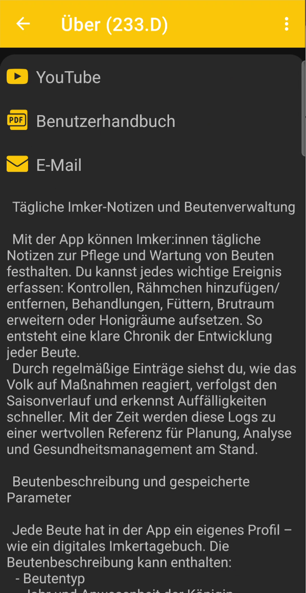

# Über die App

Die Seite **Über die App** enthält eine kurze Beschreibung von BeeApiary, nützliche Links und Angaben zur installierten Version.

{ .doc-screenshot }

Auf der Seite findest du:

- **YouTube** - Videoanleitungen zur Einrichtung und Verwendung;
- **Benutzerhandbuch** - die BeeApiary-Textdokumentation;
- **E-Mail** - Kontakt zum Support per E-Mail;
- eine kurze Beschreibung der App-Funktionen und des Imkereitagebuchs.

## App-Version

Unten auf der Seite werden die Kennung der installierten Version und das Build-Datum angezeigt.

{ .doc-screenshot }

Mit diesen Angaben kannst du prüfen, ob die App aktuell ist, und dem Support bei einer Anfrage die genaue Version nennen.
