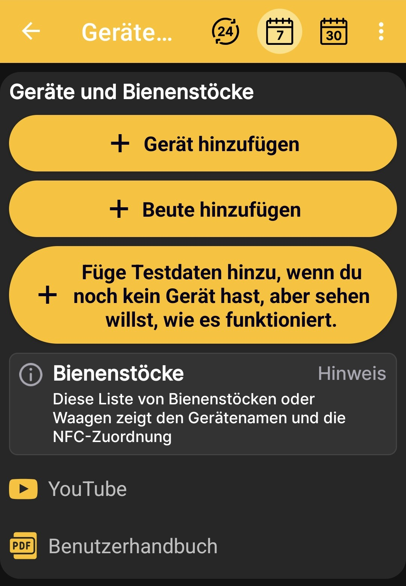

# Waage oder Bienenstock hinzufügen

Auf dem Bildschirm **Geräte und Bienenstöcke** kannst du:

- eine physische BeeApiary-Bienenstockwaage zu einem Bienenstockprofil hinzufügen;
- ein Bienenstockprofil ohne Geräte erstellen;
- zum Kennenlernen einen Testbienenstock mit Waage und Beispieldaten anlegen.

{ .doc-screenshot }

## BeeApiary-Bienenstockwaage

Mit **Gerät hinzufügen** erstellst du ein Bienenstockprofil, das mit einer physischen BeeApiary-Bienenstockwaage verbunden ist. Dieses Profil kann automatisch Gewicht, Temperatur und weitere verfügbare Messwerte empfangen.

Fahre mit [BeeApiary-Bienenstockwaage hinzufügen](../add-device.md) fort. GSM, eine direkte Wi-Fi-Verbindung, das Wi-Fi-Netzwerk am Bienenstand und Bluetooth werden unter [Daten in der App empfangen](../../system/connectivity.md) verglichen.

## Bienenstock ohne Waage

Mit **Beute hinzufügen** erstellst du ein separates Profil ohne physische Waage. Darin kannst du ein Journal führen, den [Beutenstatus](../hive-state.md) beschreiben, Notizen hinzufügen und [Ereignisse](../events-and-notes.md) festhalten.

Fahre mit [Bienenstock hinzufügen](../add-hive.md) fort.

## Testbienenstock mit simulierter Waage

Mit **Testdaten hinzufügen** erstellst du einen Testbienenstock mit einer simulierten Bienenstockwaage. Die App erzeugt realitätsnahe Daten, sodass du den Startbildschirm, Diagramme, den Beutenstatus und Ereignisse ansehen und wie bei einem Profil mit einer echten intelligenten Waage verwenden kannst.

Die Testwerte dienen nur zum Kennenlernen der App und sind keine echten Messungen.

## Zusätzliche Anleitungen

Am unteren Bildschirmrand findest du Links zu Videoanleitungen auf YouTube und zum Benutzerhandbuch. Darüber gelangst du von der ersten Auswahl des Szenarios zu ausführlichen Einrichtungsanleitungen.
