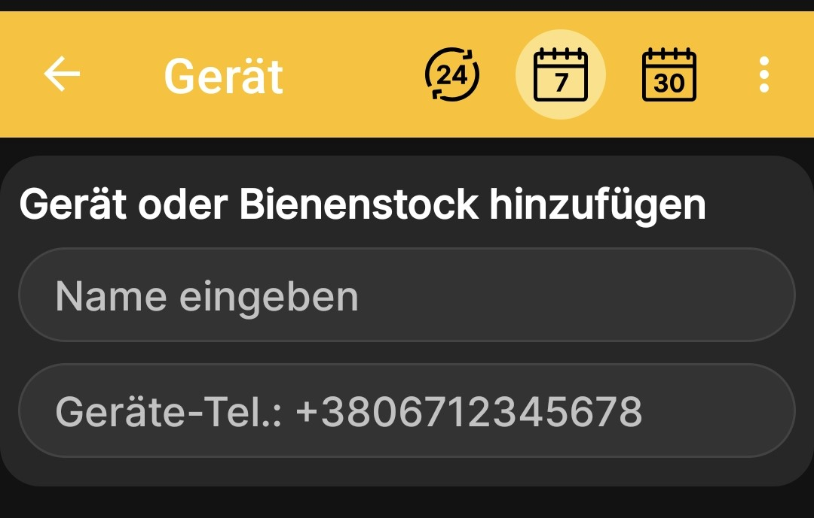
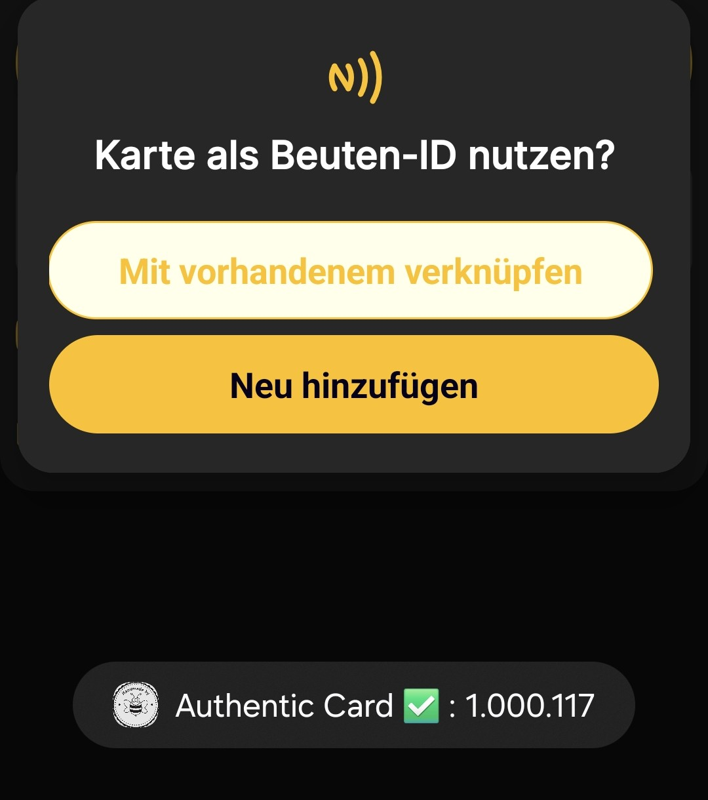
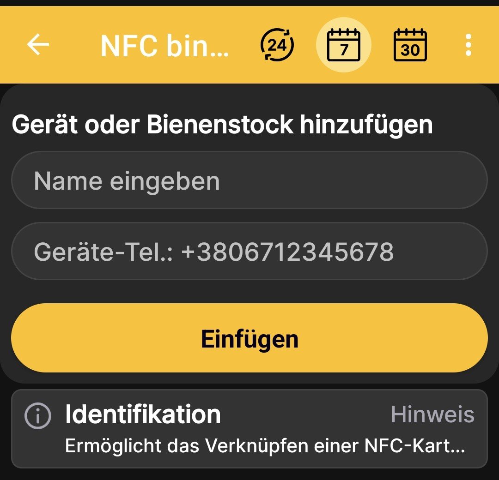

# BeeApiary-Bienenstockwaage hinzufügen

Füge eine BeeApiary-Bienenstockwaage hinzu, um ein Bienenstockprofil mit der physischen Ausrüstung zu verbinden und automatische Messwerte zu empfangen. Die verfügbaren Datenkanäle und ihre Voraussetzungen sind unter [Daten in der App empfangen](../system/connectivity.md) beschrieben.

## Waage hinzufügen

1. Öffne **Hauptmenü → Gerät oder Bienenstock hinzufügen**.
2. Tippe auf dem Bildschirm **Geräte und Bienenstöcke** auf **Gerät hinzufügen**.
3. Gib einen eindeutigen Namen für den Bienenstock oder die Bienenstockwaage ein.
4. Wenn du Daten über GSM empfangen möchtest, gib die Rufnummer der SIM-Karte ein, die in der Bienenstockwaage eingesetzt ist.

    { .doc-screenshot }

5. Tippe auf **Einfügen**.

Nach dem Speichern erscheint das Profil in der Liste der Geräte und Bienenstöcke. Daten der physischen Waage werden nach der Einrichtung und dem ersten erfolgreichen Austausch über einen der [unterstützten Kanäle](../system/connectivity.md) angezeigt.

## Über eine NFC-Karte hinzufügen

Du kannst die Bienenstockwaage hinzufügen, sobald die App eine NFC-Karte erkennt. Dabei erstellt die App das Profil und verknüpft gleichzeitig die Karte damit.

1. Halte die NFC-Karte an das Telefon.
2. Wähle bei der Frage, ob die Karte als Beuten-ID verwendet werden soll, die gewünschte Aktion:
   - **Mit vorhandenem verknüpfen** — ein bereits erstelltes Profil auswählen;
   - **Neu hinzufügen** — ein neues Profil mit dieser NFC-Verknüpfung erstellen.

    { .doc-screenshot }

3. Gib nach der Auswahl von **Neu hinzufügen** einen Namen und, für GSM, die Rufnummer der SIM-Karte in der Bienenstockwaage ein.
4. Tippe auf **Einfügen**.

    { .doc-screenshot }

Weitere Informationen zur Identifizierung von Bienenstöcken und zu den verfügbaren Aktionen findest du unter [NFC-Tags und Aktionen](nfc-settings.md).
