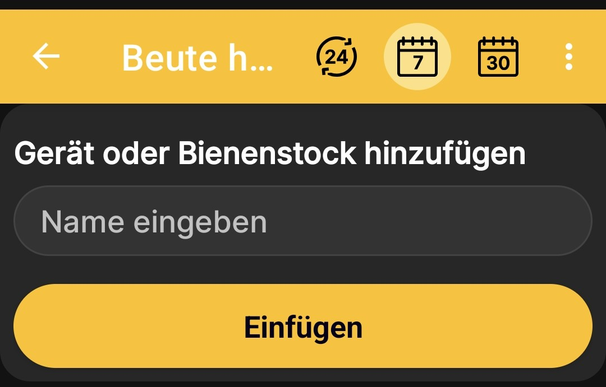

# Bienenstock hinzufügen

Erstelle ein Bienenstockprofil ohne physische Bienenstockwaage, um ein Journal zu führen, den Zustand festzuhalten, Notizen hinzuzufügen sowie geplante und erledigte Ereignisse zu speichern. Für dieses Szenario benötigst du weder eine Bienenstockwaage noch eine SIM-Karte oder die Berechtigung zum Verarbeiten von SMS.

1. Öffne **Hauptmenü → Gerät oder Bienenstock hinzufügen**.
2. Tippe auf dem Bildschirm **Geräte und Bienenstöcke** auf **Beute hinzufügen**.
3. Gib einen Namen ein, unter dem du diesen Bienenstock leicht wiederfindest.
4. Tippe auf **Einfügen**.

    { .doc-screenshot }

Nach dem Speichern erscheint das Profil in der gemeinsamen Liste der Geräte und Bienenstöcke. Verwende [Beutenstatus](hive-state.md) und [Ereignisse und Notizen](events-and-notes.md), um seine Geschichte nach und nach zu vervollständigen.
