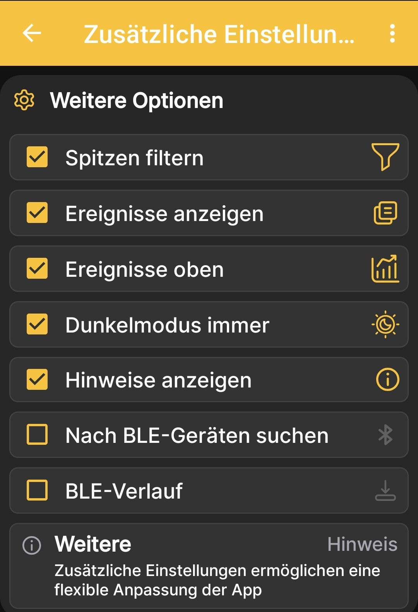

# Zusätzliche App-Einstellungen

Die zusätzlichen Einstellungen steuern die Datenfilterung, das Erscheinungsbild der App, die Ereignisanzeige und die lokale Synchronisierung über Bluetooth.

{ .doc-screenshot }

| Einstellung | Zweck |
|---|---|
| **Spitzen filtern** | Entfernt einzelne starke Ausschläge der Messwerte aus der Anzeige. |
| **Ereignisse anzeigen** | Zeigt die für die Beute gespeicherten Ereignisse an. |
| **Ereignisse oben** | Wirkt sich nur auf die grafische Darstellung aus und bestimmt die Ebenenreihenfolge: Je nach Stellung des Schalters werden Ereignisse über den Diagrammen oder Diagramme über den Ereignissen gezeichnet. |
| **Dunkelmodus immer** | Lässt das dunkle Design der App dauerhaft aktiviert. |
| **Hinweise anzeigen** | Zeigt Hilfebereiche auf den Bildschirmen der App an. |
| **Nach BLE-Geräten suchen** | Ermöglicht der App, BeeApiary-Bienenstockwaagen in der Nähe zu finden und verfügbare Daten über Bluetooth zu empfangen. Für den korrekten Betrieb muss [**BLE info**](../system/additional-settings.md) auf jeder Waage aktiviert sein, mit der du synchronisieren möchtest. |
| **BLE-Verlauf** | Empfängt zusammen mit den aktuellen Daten über Bluetooth einen längeren Messverlauf, bis zu einer Woche innerhalb des auf dem Gerät verfügbaren Verlaufs. Das ist praktisch, wenn du den Bienenstand etwa einmal pro Woche besuchst. |

Führe für die letzten beiden Einstellungen die vollständige Anleitung [Bluetooth-Synchronisierung einrichten](../guides/configure-bluetooth-sync.md) aus.

!!! note "Zwei Bildschirme nicht verwechseln"
    Diese Seite beschreibt Einstellungen der Android-App. Hardwareoptionen und Übertragungskanäle der BeeApiary-Bienenstockwaage werden unter [Zusätzliche Geräteeinstellungen](../system/additional-settings.md) beschrieben.
