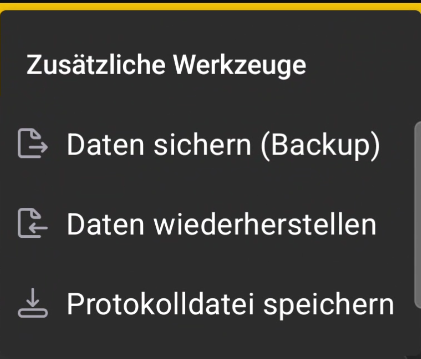

# Zusätzliche Werkzeuge

Das Untermenü **Zusätzliche Werkzeuge** enthält Befehle zur Datensicherung und Servicediagnose.

{ .doc-screenshot }

| Befehl | Zweck |
|---|---|
| **Daten sichern (Backup)** | Erstellt eine Sicherungskopie der App-Datenbank. |
| **Daten wiederherstellen** | Stellt App-Daten aus einer zuvor erstellten Sicherungskopie wieder her. |
| **Protokolldatei speichern** | Speichert eine Serviceprotokolldatei, die du zur Diagnose an den Support senden kannst. |

!!! warning "Bewahre eine aktuelle Sicherungskopie auf"
    Vergewissere dich vor der Wiederherstellung, dass du die richtige Datenkopie ausgewählt hast. Speichere die aktuelle Sicherung separat, falls du sie später noch wiederherstellen musst.
