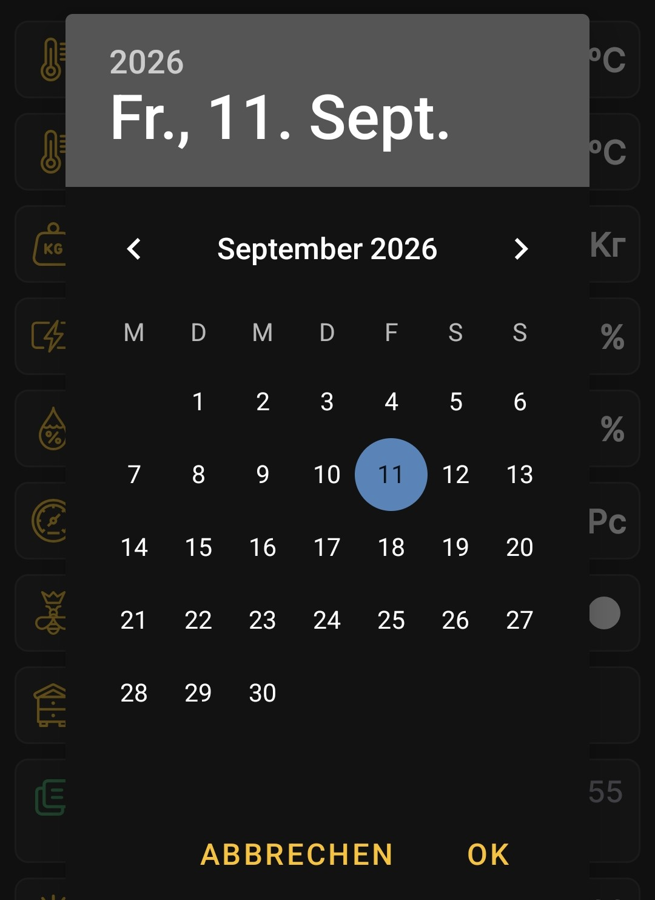

# Zeitraum der Diagramme

Tippe kurz auf die Überschrift des ausgewählten Bienenstocks auf dem Startbildschirm, um die Diagramme zu öffnen.

## Dauer des Zeitraums

Die Symbole für Tag, Woche und Monat bestimmen die Einheit des Zeitraums. Tippe mehrmals auf das jeweilige Symbol, um nacheinander 1, 2, 3 oder mehr Tage, Wochen oder Monate auszuwählen.

## Enddatum

Tippe im oberen Bereich des ausgewählten Bienenstocks auf Datum und Uhrzeit und wähle das gewünschte Datum im Kalender. Dieses Datum ist das Ende des Zeitraums; den Beginn berechnet die App anhand der ausgewählten Dauer.

Wenn du zum Beispiel als Enddatum den **4. September** und als Zeitraum **einen Monat** auswählst, zeigen die Diagramme Daten vom **4. August bis zum 4. September**.

{ .doc-screenshot }

Du kannst jedes verfügbare Enddatum auswählen, auch ein Datum vor einem Jahr. So kannst du ältere Messungen und Ereignisse anzeigen, sofern die entsprechenden Daten in der App vorhanden sind.

Nach der Auswahl erstellt die App die [Diagramme](charts.md) für den gewählten Zeitraum neu.
