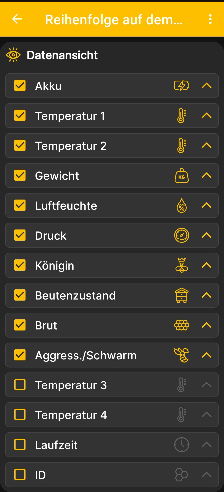

# Daten und Diagramme auswählen

Der Bildschirm **Reihenfolge auf dem Hauptbildschirm** bestimmt gleichzeitig, welche Kacheln in welcher Reihenfolge auf dem Startbildschirm erscheinen und welche Diagramme in welcher Reihenfolge auf dem Diagrammbildschirm erscheinen. Diagramme stehen nur für numerische Werte zur Verfügung, die sich im Laufe der Zeit ändern.

1. Öffne **Hauptmenü → Einstellungen → Reihenfolge auf dem Hauptbildschirm**.
2. Aktiviere die Kontrollkästchen neben den Daten, die angezeigt werden sollen.
3. Deaktiviere die Kontrollkästchen nicht benötigter Kacheln.
4. Verschiebe die wichtigsten Werte mit den Pfeilen auf der rechten Seite nach oben.

{ .doc-screenshot }

Nach der Rückkehr zum [Startbildschirm](main-screen.md) verwendet die App die ausgewählten Kacheln in der festgelegten Reihenfolge. Auf dem [Diagrammbildschirm](charts.md) bestimmen dieselben Einstellungen, welche Diagramme für die ausgewählten numerischen Werte verfügbar sind und in welcher Reihenfolge sie erscheinen.

Die einzelnen Beutenstatusfelder werden [auf einem separaten Bildschirm](hive-state-settings.md) konfiguriert. Die Anzeige von Ereignissen und die Zeichenreihenfolge von Ereignissen und Diagrammen werden in den [zusätzlichen App-Einstellungen](additional-settings.md) festgelegt.
