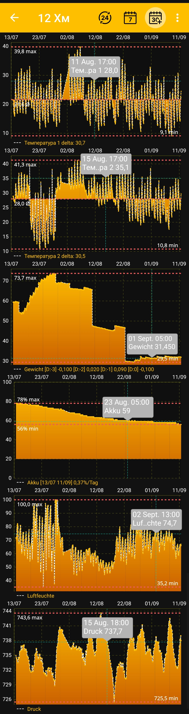

# Diagramme

Diagramme werden für numerische Werte erstellt, die sich im Laufe der Zeit ändern, zum Beispiel Gewicht, Temperatur, Luftfeuchtigkeit, Luftdruck und Batterieladung. Textbeschreibungen des Beutenstatus bleiben separate Bereiche auf dem [Startbildschirm](main-screen.md), während [Ereignisse](events-and-notes.md) als Zeitmarkierungen über den Diagrammen erscheinen können.

Nachdem du Zeitraum und Enddatum ausgewählt hast, erstellt die App die aktiven Diagramme für diesen Abschnitt neu:

{ .doc-screenshot }

## Interaktive Ansicht

- Tippe auf einen Punkt im Diagramm, um die genaue Uhrzeit und den Wert in einer Einblendung zu sehen.
- Vergrößere oder strecke die Diagramme mit Gesten, um einen bestimmten Teil des Zeitraums genauer zu betrachten.
- Markierungen für Minimal- und Maximalwerte helfen dir, den Wertebereich schnell einzuschätzen.
- Bei Temperaturen wird außerdem der Mittelwert des Zeitraums angezeigt.
- In den Diagrammen für Luftfeuchtigkeit und Luftdruck können empfohlene Werte dargestellt werden.
- Das Batteriediagramm zeigt den kritischen Entladezustand und die tägliche Änderung der Ladung.

Ereignisse des ausgewählten Bienenstocks können entsprechend ihrem Zeitpunkt zusammen mit den Messwerten angezeigt werden. So kannst du Arbeiten am Bienenstand mit Änderungen von Gewicht, Temperatur und anderen Werten vergleichen. Sichtbarkeit und Ebenenreihenfolge der Ereignisse werden unter [Zusätzliche App-Einstellungen](additional-settings.md) festgelegt.

Die verfügbaren Diagramme und ihre Reihenfolge hängen von den ausgewählten Kacheln und Anzeigeeinstellungen ab:

- [Zeitraum und Enddatum auswählen](chart-period.md)
- [Daten, Diagramme und ihre Reihenfolge auswählen](chart-settings.md)

Zusätzliche Kennwerte und Bedienmöglichkeiten können in zukünftigen Versionen der App erweitert werden.
