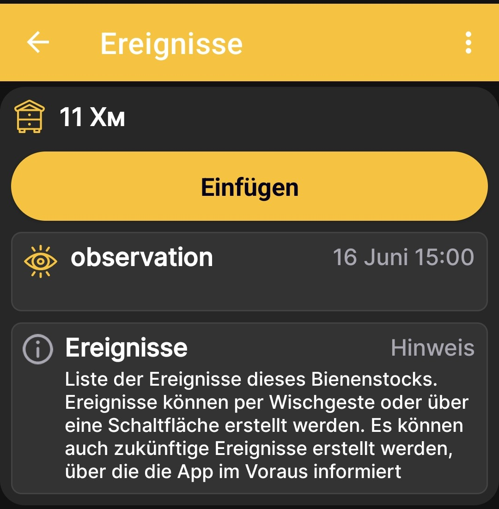
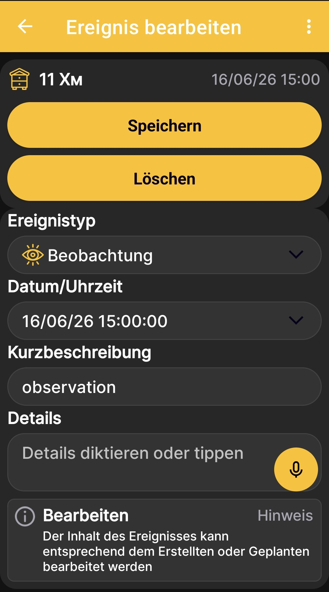
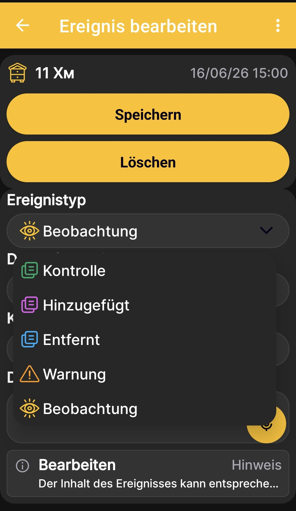

# Ereignisse und Notizen

Mit Ereignissen kannst du für jeden Bienenstock eine Chronik der Arbeiten, Kontrollen und Beobachtungen führen. Wische auf dem [Startbildschirm der App](main-screen.md) nach rechts, um die Ereignisliste zu öffnen.

## Ereignisliste

Auf dem Bildschirm werden der ausgewählte Bienenstock und die dafür gespeicherten Ereignisse angezeigt. Jeder Eintrag enthält ein Symbol für den Typ, einen Namen, eine farbliche Kennzeichnung sowie Datum und Uhrzeit. Tippe auf **Einfügen**, um ein Ereignis zu erstellen, oder wähle einen vorhandenen Eintrag zum Bearbeiten aus.

{ .doc-screenshot }

Du kannst auch zukünftige, geplante Ereignisse erstellen. Die App erinnert dich im Voraus daran, damit geplante Arbeiten nicht zwischen den aktuellen Einträgen verloren gehen.

## Ereignis hinzufügen oder bearbeiten

{ .doc-screenshot }

| Element | Zweck |
|---|---|
| **Ereignistyp** | Bestimmt den Zweck, das Symbol und die farbliche Kennzeichnung des Eintrags. |
| **Datum/Uhrzeit** | Hält den Zeitpunkt des Ereignisses oder den Termin einer geplanten Arbeit fest. |
| **Kurzbeschreibung** | Gibt der ausgeführten oder geplanten Arbeit einen kurzen Namen. |
| **Details** | Speichert zusätzliche Angaben, Kontrollergebnisse oder eine Notiz. |
| **Speichern** | Speichert ein neues Ereignis oder deine Änderungen. |
| **Löschen** | Löscht das geöffnete Ereignis. |

!!! note "Spracheingabe"
    Ein mit einem Mikrofonsymbol gekennzeichnetes Feld unterstützt Diktieren. Die App wandelt deine Sprache in Text um, den du später bearbeiten, durchsuchen und kopieren kannst. Eine Audiodatei wird dabei nicht gespeichert.

## Ereignistypen

{ .doc-screenshot }

| Typ | Verwendung |
|---|---|
| **Kontrolle** | Zum Festhalten der Ergebnisse einer Kontrolle des Bienenstocks. |
| **Hinzugefügt** | Um zu kennzeichnen, dass dem Bienenstock etwas hinzugefügt wurde. |
| **Entfernt** | Um zu kennzeichnen, dass etwas aus dem Bienenstock entnommen wurde. |
| **Warnung** | Für Ereignisse, die besondere Aufmerksamkeit erfordern. |
| **Beobachtung** | Zum Festhalten eines beobachteten Zustands oder Vorgangs. |

Die Ereignistypen unterscheiden sich durch Farben und Symbole. In den [Diagrammen](charts.md) werden Ereignisse mit Zeitstempeln dargestellt und entsprechend ihrem Zeitpunkt positioniert. So kannst du Arbeiten am Bienenstand mit Veränderungen von Gewicht, Temperatur und anderen Messwerten vergleichen.
