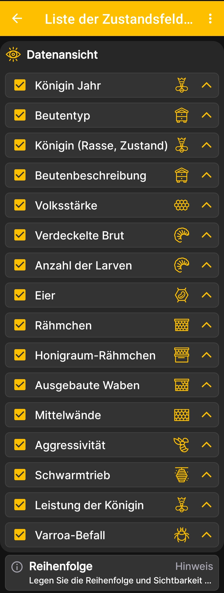

# Reihenfolge der Beutenstatusfelder

Dieser Bildschirm steuert die Sichtbarkeit und Reihenfolge der Felder im erweiterten [Beutenstatus](hive-state.md).

1. Öffne **Hauptmenü → Einstellungen → Liste der Zustandsfelder**.
2. Lass die Kontrollkästchen neben den Informationen aktiviert, die angezeigt werden sollen.
3. Deaktiviere Felder, die an deinem Bienenstand nicht verwendet werden.
4. Verschiebe wichtigere Felder mit den Pfeilen auf der rechten Seite nach oben.

{ .doc-screenshot }

Du kannst die Anzeige des Königinnenjahrs und -zustands, des Beutentyps und der Beutenbeschreibung, der Volksstärke, der Brut, der Larven, der Eier, verschiedener Rähmchentypen, der Aggressivität, des Schwarmtriebs, der Leistung der Königin und des Varroa-Befalls konfigurieren.

Eine geänderte Reihenfolge wirkt sich auf die Darstellung in der App aus, verändert aber nicht die gespeicherten Aufzeichnungen zur Beute.
