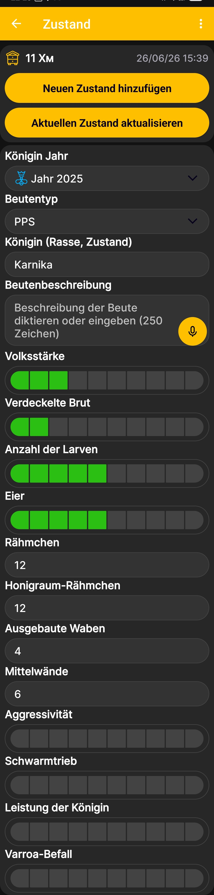

# Beutenstatus

Im Beutenstatus kannst du Ergebnisse von Kontrollen festhalten, darunter Angaben zur Königin, Volksstärke, Brut, zu den Rähmchen und weitere wichtige Werte. Wische auf dem [Startbildschirm der App](main-screen.md) nach links, um diesen Bildschirm zu öffnen.

{ .doc-screenshot }

## Beutenstatus hinzufügen und aktualisieren

Oben auf dem Bildschirm werden der ausgewählte Bienenstock sowie Datum und Uhrzeit des Eintrags angezeigt.

- **Neuen Zustand hinzufügen** erstellt einen separaten Statuseintrag für das ausgewählte Datum und die ausgewählte Uhrzeit.
- **Aktuellen Zustand aktualisieren** speichert Änderungen im aktuellen Eintrag, ohne einen weiteren Statuseintrag zu erstellen.

## Felder des Beutenstatus

| Feld | Einzutragende Information |
|---|---|
| **Königin Jahr** | Das Jahr, in dem die Königin aufgezogen oder zugesetzt wurde. |
| **Beutentyp** | Die Beutenkonstruktion aus der konfigurierten Liste der [Beutentypen](hive-types.md). |
| **Königin (Rasse, Zustand)** | Die Rasse der Königin und eine kurze Einschätzung ihres aktuellen Zustands. |
| **Beutenbeschreibung** | Eine freie Beschreibung der Ergebnisse der Kontrolle. |
| **Volksstärke** | Eine relative Einschätzung der Stärke des Bienenvolks anhand der Skala. |
| **Verdeckelte Brut** | Eine relative Einschätzung der Menge verdeckelter Brut. |
| **Anzahl der Larven** | Eine relative Einschätzung der Anzahl der Larven. |
| **Eier** | Eine relative Einschätzung der Anzahl der Eier. |
| **Rähmchen** | Die Gesamtzahl der Rähmchen in der Beute. |
| **Honigraum-Rähmchen** | Die Anzahl der eingesetzten Honigraum-Rähmchen. |
| **Ausgebaute Waben** | Die Anzahl der Rähmchen mit ausgebauten Waben. |
| **Mittelwände** | Die Anzahl der Rähmchen mit eingesetzten Mittelwänden. |
| **Aggressivität** | Eine relative Einschätzung der Aggressivität des Bienenvolks. |
| **Schwarmtrieb** | Eine relative Einschätzung des Schwarmzustands des Bienenvolks. |
| **Leistung der Königin** | Eine relative Einschätzung der Leistung der Königin. |
| **Varroa-Befall** | Eine relative Einschätzung des Varroa-Befalls. |

Felder mit einer Skala sind für relative Einschätzungen vorgesehen, während in die Rähmchenfelder Anzahlen eingegeben werden. Trage nur die Angaben ein, die du für deine Art der Imkerei benötigst.

!!! note "Spracheingabe"
    Ein mit einem Mikrofonsymbol gekennzeichnetes Feld musst du nicht von Hand ausfüllen. Diktiere die Beschreibung, und die App wandelt deine Sprache in Text um. Dabei entsteht ein Text, den du bearbeiten, durchsuchen und kopieren kannst, keine gespeicherte Audiodatei.

Im Menü [Reihenfolge der Beutenstatusfelder](hive-state-settings.md) legst du fest, welche Felder auf dem Bildschirm erscheinen und in welcher Reihenfolge.
