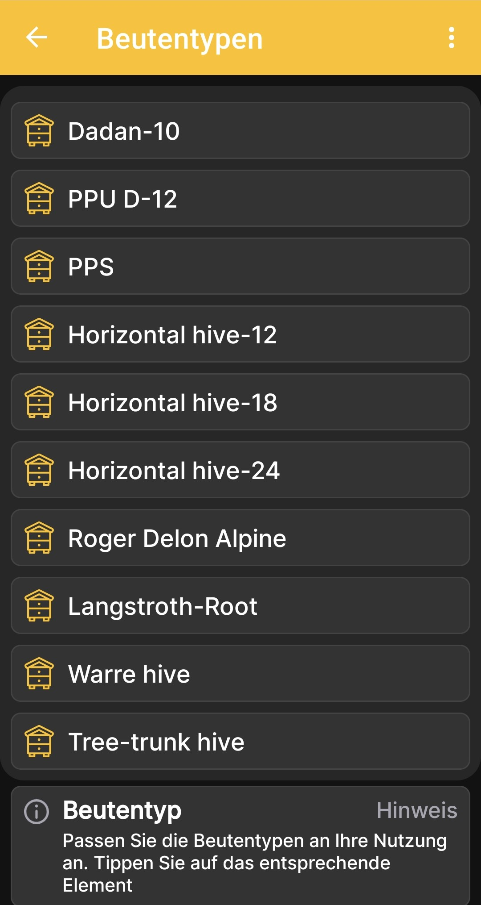

# Beutentypen

Auf dem Bildschirm **Beutentypen** kannst du die Liste der Beutentypen an die an deinem Bienenstand verwendeten Typen anpassen. Die App enthält mehrere Beispiele, die anfängliche Liste soll jedoch nicht alle Beutenkonstruktionen abdecken.

An den meisten Bienenständen werden ein bis fünf Beutentypen verwendet. Die ursprüngliche Liste bietet daher etwas Reserve für den üblichen Einsatz. Du kannst vorhandene Typen frei ändern oder die Liste passend zu deinem Bienenstand erweitern.

1. Öffne **Hauptmenü → Einstellungen → Beutentypen**.
2. Suche den gewünschten Typ in der Liste.
3. Tippe auf die entsprechende Kachel, um seine Verwendung in der App zu konfigurieren.

{ .doc-screenshot }

Diese Einstellung gehört zu den Beutenbeschreibungen in der App und verändert nicht die Hardwarekonfiguration der BeeApiary-Bienenstockwaage.
