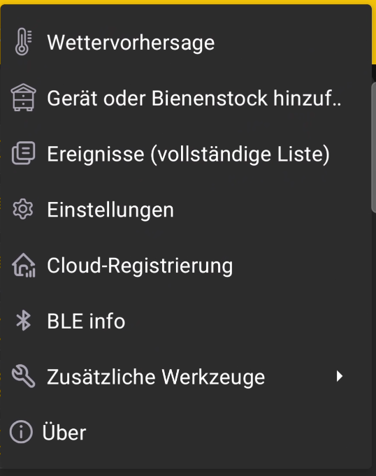

# Hauptmenü

Öffne das Menü oben rechts auf dem Hauptbildschirm, um auf die allgemeinen Funktionen der App zuzugreifen.

{ .doc-screenshot }

| Menüpunkt | Zweck |
|---|---|
| **Wettervorhersage** | Zeigt die Wettervorhersage für die Arbeit am Bienenstand. |
| **Gerät oder Bienenstock hinzufügen** | Öffnet das Hinzufügen von [BeeApiary-Bienenstockwaagen](add-device.md) oder eines separaten [Bienenstockprofils](add-hive.md). |
| **Ereignisse (vollständige Liste)** | Öffnet [Ereignisse und Notizen](events-and-notes.md) für alle Bienenstöcke. |
| **Einstellungen** | Öffnet die allgemeinen [App-Einstellungen](settings/index.md). |
| **Cloud-Registrierung** | Bereitet das Gerät auf die [Synchronisierung über das WLAN-Netzwerk am Bienenstand](../guides/configure-wifi-sync.md) vor. |
| **BLE info** | Öffnet Informationen zur [Synchronisierung über Bluetooth](../system/bluetooth.md). |
| **Zusätzliche Werkzeuge** | Öffnet Werkzeuge für [Datensicherung, Wiederherstellung und Export des Serviceprotokolls](additional-tools.md). |
| **Über** | Zeigt die [Beschreibung, nützliche Links und installierte Version](about.md). |
