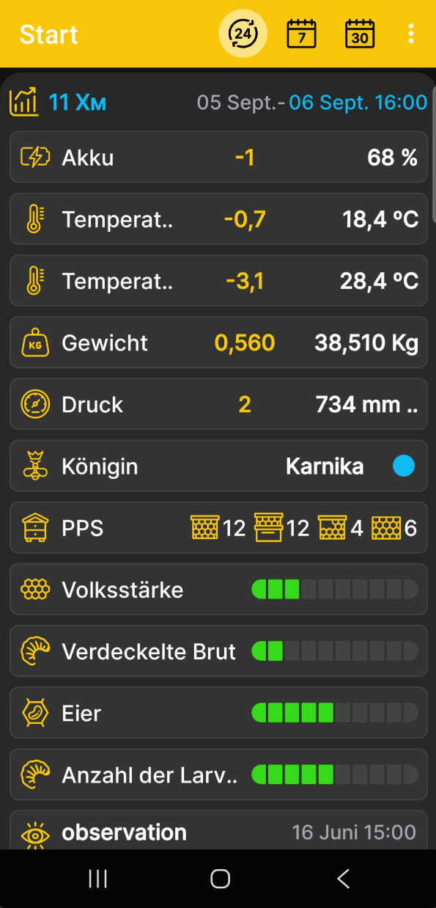

# Startbildschirm der App

Der Startbildschirm vereint numerische Messwerte, den Beutenstatus und die letzten Ereignisse für den ausgewählten Bienenstock oder die BeeApiary-Bienenstockwaage. Einen separaten Messwertbildschirm gibt es in der App nicht: Alle verfügbaren Daten bilden gemeinsam die Beschreibung der Beute.

{ .doc-screenshot }

## Anzeigen auf dem Bildschirm

- der ausgewählte Bienenstock oder die BeeApiary-Bienenstockwaage;
- numerische Werte für Gewicht, Temperatur, Luftfeuchtigkeit, Druck und Batterieladung, sofern die entsprechenden Daten verfügbar sind;
- der [Zustand des Bienenstocks](hive-state.md), der Königin, der Rähmchen und der Brut sowie weitere Profileinträge;
- die fünf letzten vom Benutzer erfassten [Ereignisse](events-and-notes.md).

Die verfügbaren Bereiche hängen von den Daten, Sensoren und Angaben ab, die für den ausgewählten Bienenstock hinterlegt sind.

Sichtbarkeit und Reihenfolge der Kacheln werden unter [Daten und Diagramme auswählen](chart-settings.md) festgelegt. Numerische Werte, die sich im Laufe der Zeit ändern, können auch als [Diagramme](charts.md) dargestellt werden. Für den Beutenstatus gibt es eine [separate Einstellung der Felder](hive-state-settings.md).

## Zeitraum und Werte

Mit den Symbolen oben auf dem Bildschirm wechselst du die Einheit des Zeitraums zwischen Tagen, Wochen und Monaten. Tippe mehrmals auf das entsprechende Symbol, um nacheinander 1, 2, 3 oder mehr Tage, Wochen oder Monate auszuwählen.

Tippe oben im Bereich des ausgewählten Bienenstocks auf Datum und Uhrzeit, um das Enddatum des Zeitraums festzulegen. Weitere Informationen findest du unter [Zeitraum der Diagramme](chart-period.md).

Für jeden numerischen Messwert gilt:

- Rechts wird in Weiß die letzte Messung am Ende des ausgewählten Zeitraums angezeigt.
- In Gelb erscheint die Änderung, also die Differenz zwischen den Werten am Anfang und am Ende des ausgewählten Zeitraums.

## Schnellzugriff

Tippe kurz auf die Überschrift des ausgewählten Bienenstocks, um die [Diagramme](charts.md) zu öffnen. Halte die Überschrift gedrückt, um die [Auswahl der Daten und die Reihenfolge der Diagramme](chart-settings.md) zu öffnen.

- Wische nach links, um den [Beutenstatus](hive-state.md) zu öffnen, einen neuen Eintrag hinzuzufügen oder den aktuellen zu aktualisieren.
- Wische nach rechts, um [Ereignisse und Notizen](events-and-notes.md) zu öffnen, ein neues Ereignis hinzuzufügen oder ein vorhandenes zu bearbeiten.
