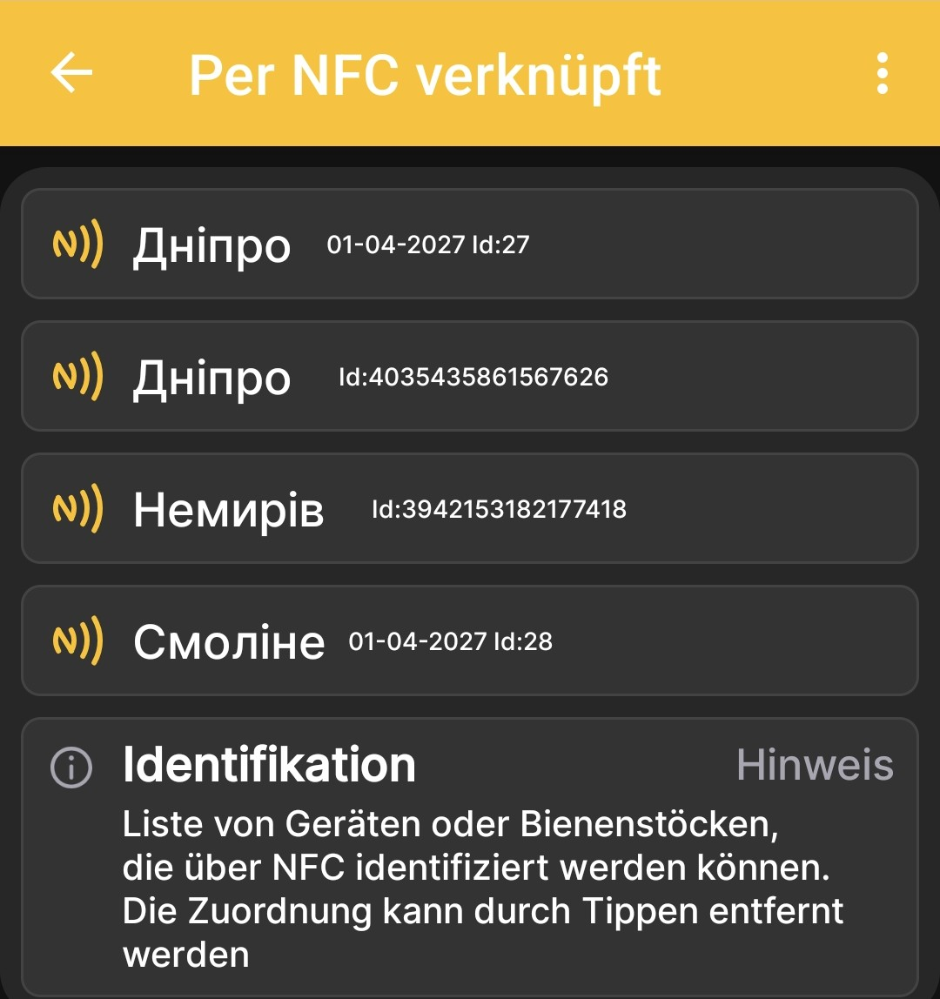
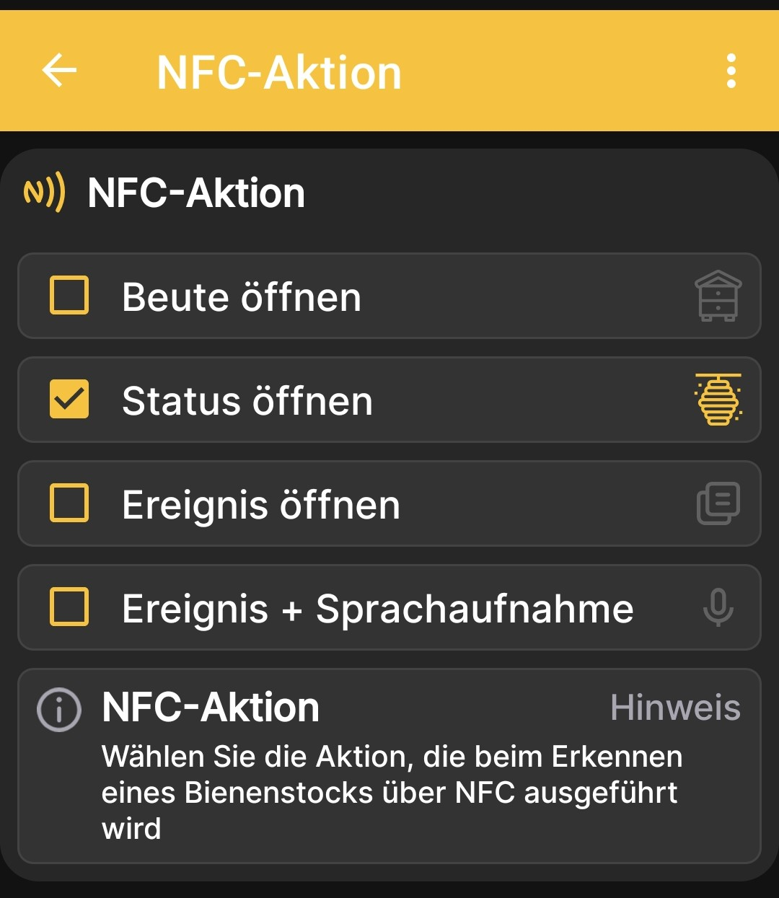

# NFC-Tags und Aktionen

Die NFC-Einstellungen bestehen aus zwei zusammengehörigen Bildschirmen: der Liste verknüpfter Tags und der Aktion, die die App nach dem Erkennen einer Beute ausführt.

## Was ist ein NFC-Tag?

Ein NFC-Tag ist ein kleiner elektronischer Identifikator. Er kann die Form eines Schlüsselanhängers, einer Münze, eines Aufklebers, einer normalen NFC-Karte oder einer speziellen Beutenkarte haben. Befestige den Tag an einer gut lesbaren Stelle der Beute, beispielsweise unter dem Deckel oder an einer Wand.

Wenn du ein NFC-fähiges Telefon an den Tag hältst, erkennt die App schnell die betreffende Beute und führt die ausgewählte Aktion aus: Sie öffnet die Beutendetails, den Status oder die Ereignisse oder beginnt sofort mit dem Erstellen eines Ereignisses per Spracheingabe.

Du musst einen kompatiblen Tag nur einmal mit dem Beutenprofil verknüpfen und an der Beute belassen. Dadurch findest du das richtige Profil schneller und kannst ohne separate Notizen auf Papier eine vollständigere Historie führen.

!!! info "Eine Sprachnotiz wird zu Text"
    Die App speichert nicht nur eine Sprachaufnahme: Sie wandelt die diktierte Notiz in Text um. Das ist besonders praktisch bei der Arbeit mit Schutzhandschuhen, bei der Zuchtarbeit oder bei der Kontrolle vieler Beuten nacheinander. Später kannst du den Text einfach lesen, durchsuchen, bearbeiten und bei Bedarf kopieren.

## Verknüpfte NFC-Tags { #linked-nfc-tags }

Öffne **Hauptmenü → Einstellungen → NFC-Tags**, um die Geräte oder Bienenstöcke anzuzeigen, die die App über NFC identifizieren kann.

{ .doc-screenshot }

Die Liste zeigt den Namen und die Kennung jedes verknüpften Profils. Durch Tippen auf die entsprechende Kachel wird die NFC-Verknüpfung entfernt.

!!! info "Liste der Geräte und Bienenstöcke"
    In der Liste der Geräte und Bienenstöcke zeigt ein separates NFC-Symbol an, dass ein Tag verknüpft ist. Ein direkter Link zur vollständigen Beschreibung dieses Bildschirms wird nach Abschluss seiner Prüfung ergänzt.

## Aktion nach der Erkennung { #nfc-action }

Öffne **Hauptmenü → Einstellungen → NFC-Aktion** und wähle aus, was die App nach dem Erkennen eines NFC-Tags öffnen soll.

{ .doc-screenshot }

Verfügbare Aktionen:

- **Beute öffnen**;
- **Status öffnen**;
- **Ereignis öffnen**;
- **Ereignis + Sprachaufnahme**.

Die letzte Option öffnet nach der Identifizierung der Beute sofort die Ereigniserstellung mit Spracheingabe.
