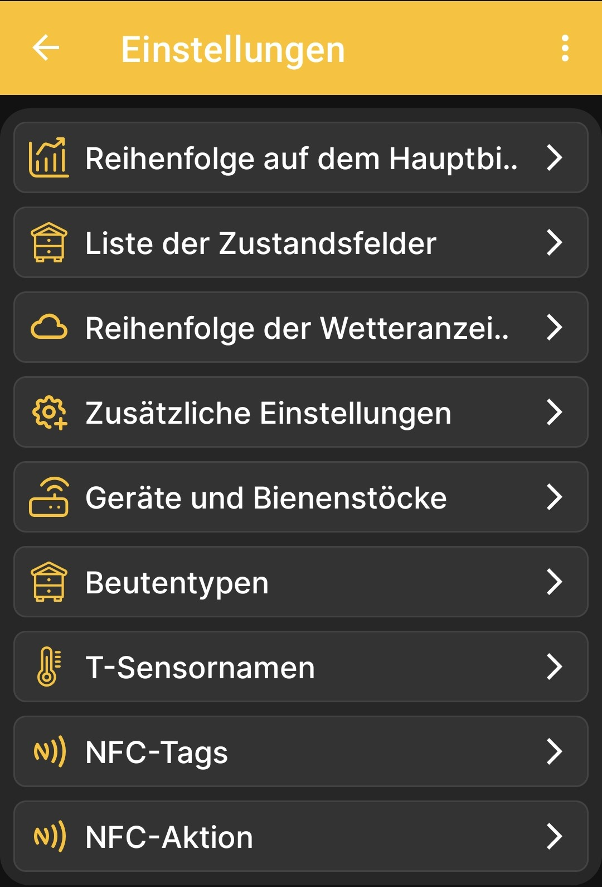

# App-Einstellungen

Die Seite **Einstellungen** ist das übergeordnete Menü für die Anzeige- und Verhaltensoptionen der App. Jeder Eintrag öffnet einen eigenen untergeordneten Bildschirm.

{ .doc-screenshot }

| Menüpunkt | Zweck |
|---|---|
| **Reihenfolge auf dem Hauptbildschirm** | Öffnet die [Auswahl von Daten und Diagrammen](../chart-settings.md). Diese Einstellungen bestimmen, welche Kacheln in welcher Reihenfolge auf dem Startbildschirm erscheinen und, bei numerischen Werten, welche Diagramme in welcher Reihenfolge auf dem Diagrammbildschirm erscheinen. |
| **Liste der Zustandsfelder** | Öffnet die [Einstellungen der Beutenstatusfelder](../hive-state-settings.md). |
| **Reihenfolge der Wetteranzeige** | Öffnet die [Einstellungen der Wettervorhersagedaten](../weather-settings.md). |
| **Zusätzliche Einstellungen** | Öffnet [weitere Optionen für das Verhalten der App](../additional-settings.md), darunter die Ereignisanzeige und die Bluetooth-Funktion. |
| **Geräte und Bienenstöcke** | Verwaltet die Profilliste. Das Hinzufügen einer [BeeApiary-Bienenstockwaage](../add-device.md) und [eines Bienenstocks](../add-hive.md) wird separat beschrieben; eine vollständige Beschreibung dieses Bildschirms wird noch vorbereitet. |
| **Beutentypen** | Öffnet die [Liste der Beutentypen](../hive-types.md), die am Bienenstand verwendet werden. |
| **T-Sensornamen** | Ermöglicht verständliche Namen für die Temperaturkanäle. Eine ausführliche Beschreibung folgt nach einer separaten Prüfung dieses Bildschirms. |
| **NFC-Tags** | Zeigt die [über NFC verknüpften Geräte und Bienenstöcke](../nfc-settings.md#linked-nfc-tags). |
| **NFC-Aktion** | Legt die [Aktion nach dem Erkennen eines NFC-Tags](../nfc-settings.md#nfc-action) fest. |

## Zugehörige Einstellungen

Die Konfiguration der BeeApiary-Bienenstockwaage über ihre lokale Weboberfläche wird separat beschrieben: [Direkte WLAN-Verbindung mit dem Gerät](../../system/local-wifi.md#direct-access-point).

- [Synchronisierung über das WLAN-Netzwerk am Bienenstand einrichten](../../guides/configure-wifi-sync.md)
- [Synchronisierung über Bluetooth einrichten](../../guides/configure-bluetooth-sync.md)
