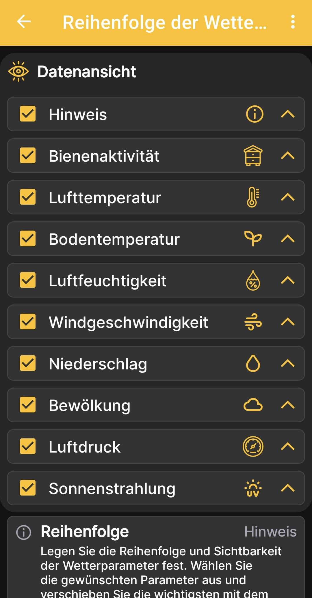

# Reihenfolge der Wetterdaten

Dieser Bildschirm bestimmt, welche Daten die Wettervorhersage anzeigt und in welcher Reihenfolge sie erscheinen.

1. Öffne **Hauptmenü → Einstellungen → Reihenfolge der Wetteranzeige**.
2. Aktiviere oder deaktiviere die Kontrollkästchen neben den gewünschten Werten.
3. Verschiebe die wichtigsten Daten mit den Pfeilen auf der rechten Seite nach oben.

{ .doc-screenshot }

Verfügbar sind Hinweise, Bienenaktivität, Luft- und Bodentemperatur, Luftfeuchtigkeit, Windgeschwindigkeit, Niederschlag, Bewölkung, Luftdruck und Sonnenstrahlung.

Diese Einstellung gehört zur Wettervorhersage in der Android-App. Sie aktiviert oder deaktiviert keine physischen Sensoren der BeeApiary-Bienenstockwaage.
