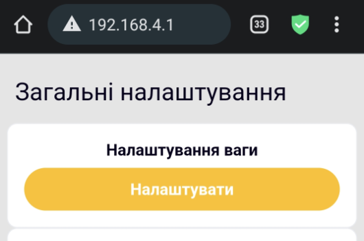

# Kalibrierung und Tarierung

!!! danger "Ein neues Gerät muss nicht kalibriert werden"
    Eine Kalibrierung ist hauptsächlich nach einer Reparatur oder dem Verlust der werkseitigen Kalibrierungsdaten erforderlich. Verwende sie nicht als allgemeines Verfahren zur Behebung eines falschen Gewichtswerts.

## Kalibrierung

1. Trenne die externe Stromversorgung.
2. Stelle alle Wägesensoren auf eine feste, ebene Fläche und lasse die Plattform leer.
3. Verbinde dich mit dem Zugangspunkt des Geräts und öffne in seiner Weboberfläche **Allgemeine Einstellungen → Waageneinstellungen**.

    { .doc-screenshot }

4. Starte die **Nullpunktkalibrierung** und warte, bis sie abgeschlossen ist, ohne die Plattform zu berühren.

    Der Bildschirm zeigt zwei Kalibrierungsschritte:

    { .doc-screenshot }

    { .doc-screenshot }

5. Wähle ein verfügbares Referenzgewicht von 500, 1000 oder 5000 g und lege es auf die Plattform.

    { .doc-screenshot }

6. Starte die **Referenzkalibrierung** und warte auf das Ergebnis.

    { .doc-screenshot }

    { .doc-screenshot }

## Tarierung

Du kannst ein bekanntes Taragewicht in Gramm eingeben:

{ .doc-screenshot }

Alternativ kannst du das aktuelle Plattformgewicht als null übernehmen:

{ .doc-screenshot }

Die Tarierung ändert den werkseitigen Kalibrierungsfaktor nicht.

Separate Anleitungen: [Waage tarieren](../guides/tare-scales.md) und [Waage kalibrieren](../guides/calibrate-scales.md).
