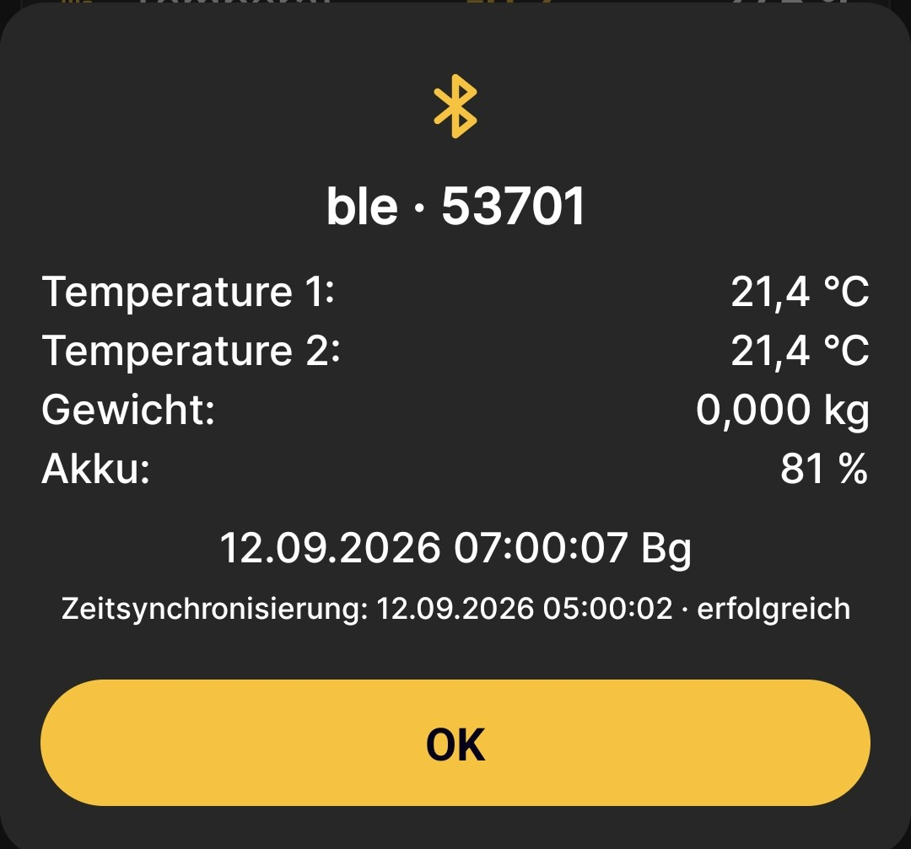

# So richtest du die Bluetooth-Synchronisierung ein

!!! danger "Gerätekompatibilität"
    Diese Funktion wird nur von Geräten unterstützt, die nach August 2026 hergestellt wurden. Ältere Geräte können diese Funktion ebenfalls erhalten, müssen dafür jedoch im Werk aktualisiert werden. Einen einfachen Patch zur selbstständigen Installation gibt es derzeit nicht.

Mit diesem Verfahren richtest du den automatischen Datenempfang von BeeApiary-Bienenstockwaagen ein, wenn sich das Telefon in der Nähe befindet. Für die Synchronisierung sind weder eine SIM-Karte noch Internetzugang erforderlich.

## Vorbereitungen

1. Vergewissere dich, dass die Waage die oben genannten Kompatibilitätsanforderungen erfüllt.
2. [Synchronisiere die Uhr der Waage](../system/time-synchronization.md) mit dem Telefon. Die Abweichung darf zwei Minuten nicht überschreiten.
3. Aktiviere Bluetooth auf dem Telefon.
4. Erteile der App alle angeforderten Berechtigungen, einschließlich der Bluetooth-Berechtigungen.
5. Erlaube der App, im Hintergrund zu arbeiten und zur erforderlichen Zeit aufzuwachen. Beachte die aktuellen [Empfehlungen zur App-Installation](../app/installation.md).

!!! warning "Zeit vor der Einrichtung prüfen"
    Bei einer Abweichung von mehr als zwei Minuten kann die Waage früher oder später als das Telefon für die Verbindung bereit sein. Die automatische Synchronisierung findet dann nicht statt.

## BLE info auf der Waage aktivieren

1. [Verbinde dich mit dem Zugangspunkt der Waage](configure-local-wifi.md).
2. Öffne `http://192.168.4.1` und wähle **Zusätzliche Einstellungen**.
3. Aktiviere **BLE info** und speichere die Änderungen.

Diese und die weiteren Optionen werden unter [Zusätzliche Geräteeinstellungen](../system/additional-settings.md) erklärt.

## Synchronisierung in der App aktivieren

4. Öffne das Hauptmenü der App, gehe zu **Einstellungen** und öffne **Zusätzliche Einstellungen**.
5. Aktiviere **Nach BLE-Geräten suchen**, damit die App Waagen in der Nähe finden und Messwerte empfangen kann.
6. Aktiviere **BLE-Verlauf**, damit die App zusätzlich den gespeicherten Verlauf abruft, einschließlich der Daten des letzten Tages.

    { .doc-screenshot }

    !!! warning "Erforderliche Optionen aktivieren"
        Der Screenshot ist ein allgemeines Beispiel, daher werden beide Bluetooth-Schalter als deaktiviert angezeigt. **Nach BLE-Geräten suchen** muss für die Synchronisierung aktiviert sein. Es wird außerdem empfohlen, **BLE-Verlauf** zu aktivieren, damit die App den verfügbaren Verlauf abrufen und fehlende Messwerte wiederherstellen kann.

    Eine vollständige Beschreibung dieses Bildschirms findest du unter [Zusätzliche App-Einstellungen](../app/additional-settings.md).

7. Kehre zum Startbildschirm der App zurück. Lasse Bluetooth eingeschaltet und halte das Telefon während des nächsten stündlichen Zyklus in zuverlässiger Bluetooth-Reichweite.

## Ergebnis prüfen

Die Synchronisierung findet nur statt, wenn **BLE info** auf der Waage sowie Bluetooth und die entsprechenden App-Optionen auf dem Telefon aktiviert sind. Die Waage ist während eines planmäßigen Aufwachvorgangs oder nach der [Aktivierung mit dem Magnetschlüssel](../device/installation.md#activation-reset) für den Datenaustausch verfügbar.

Die App kann Daten austauschen, während sie geöffnet ist oder im Hintergrund läuft, sofern Android ihr erlaubt, zur erforderlichen Zeit zu arbeiten und aufzuwachen.

8. Warte auf eine Meldung, dass Daten empfangen wurden.

    { .doc-screenshot }

    Dieses Fenster zeigt:

    - den Namen der Beute und die Nummer der Waage;
    - den letzten verfügbaren Messwertsatz entsprechend der Konfiguration der Waage;
    - Datum und Uhrzeit der empfangenen Messung;
    - Zeitpunkt und Ergebnis der Uhrzeitsynchronisierung.

    Bei der ersten Verbindung mit einer noch nicht registrierten Waage kann zusätzlich die Schaltfläche **Gerät hinzufügen** erscheinen. Verwende sie, um einmalig das Standardverfahren zum [Hinzufügen einer BeeApiary-Bienenstockwaage](../app/add-device.md) auszuführen. Danach erkennt die App die Waage automatisch.

9. Tippe auf **OK**. Bei Bedarf kannst du die letzte Meldung über **BLE Info** im Hauptmenü erneut öffnen.
10. Prüfe, ob die neuen Werte auf dem Startbildschirm und in den Diagrammen der App angezeigt werden.

Fertig: Solange sich das Telefon in der Nähe befindet, empfängt die App die verfügbaren Daten automatisch. War die Verbindung mehrere Stunden unterbrochen, kann der aktivierte **BLE-Verlauf** die fehlenden Messwerte bei der nächsten erfolgreichen Synchronisierung innerhalb des verfügbaren Verlaufs von einem Tag bis zu einer Woche wiederherstellen.

Weitere Informationen zur Funktionsweise findest du unter [Datensynchronisierung über Bluetooth](../system/bluetooth.md).
