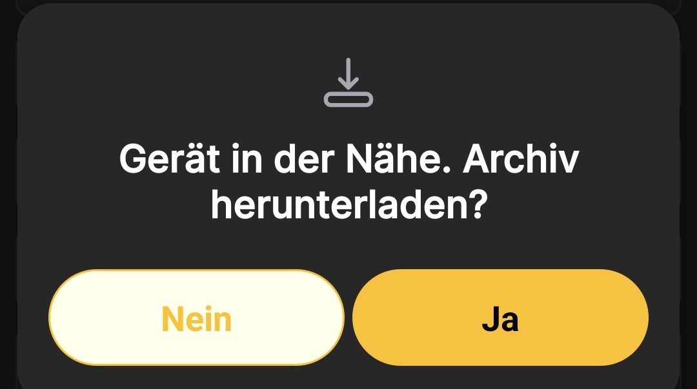

# So lädst du das Archiv herunter

Vergewissere dich vor Beginn, dass die BeeApiary-App über Google Play aktualisiert wurde und auf der Bienenstockwaage eine Firmware vom August 2024 oder neuer installiert ist. Wenn die installierte Version älter ist oder du das Veröffentlichungsdatum nicht kennst, folge der Anleitung [Firmware der BeeApiary-Bienenstockwaage aktualisieren](update-device.md).

Das manuelle Herunterladen des Archivs ist hilfreich, wenn in der Waage keine SIM-Karte steckt, andere Synchronisierungswege vorübergehend nicht verfügbar sind oder Lücken in den Messwerten aufgetreten sind. Die App importiert die gespeicherten Daten und ergänzt damit den lokalen Verlauf.

!!! warning "microSD und Batterieladung"
    In der Waage muss eine funktionsfähige microSD-Karte mit verfügbaren Daten eingesetzt sein. Eine direkte Wi-Fi-Verbindung hält die Waage aktiv und erhöht den Energieverbrauch. Führe diesen Vorgang deshalb in der Regel höchstens einmal täglich aus.

1. [Aktiviere die BeeApiary-Bienenstockwaage oder starte sie neu](../device/installation.md#activation-reset), indem du den Magnetschlüssel verwendest.
2. Verbinde das Telefon innerhalb des verfügbaren Zeitfensters, normalerweise etwa einer Minute, mit `apiary_net` und bleibe in der Nähe der Waage.
3. Öffne die BeeApiary-App.
4. Warte, bis die App die Waage in der Nähe automatisch erkennt.
5. Tippe in der Meldung **„Gerät in der Nähe. Archiv herunterladen?“** auf **Ja**.

    { .doc-screenshot }

6. Warte, bis der Import abgeschlossen ist, und trenne das Telefon danach sofort von `apiary_net`. Anschließend kann die Waage in den Ruhemodus wechseln und verbraucht nicht unnötig Batterieladung.
7. Sieh dir die heruntergeladenen Daten auf den üblichen Bildschirmen der App an.

    { .doc-screenshot }

Nach der Bestätigung lädt die App das Archiv automatisch herunter und speichert eine lokale Kopie der Messwerte. Wenn über andere Kanäle Daten fehlen, kann das Archiv die entsprechenden Lücken im Verlauf schließen. Das Archivformat und die Speicherdauer sind unter [Datenspeicherung](../system/data-storage.md) beschrieben.
