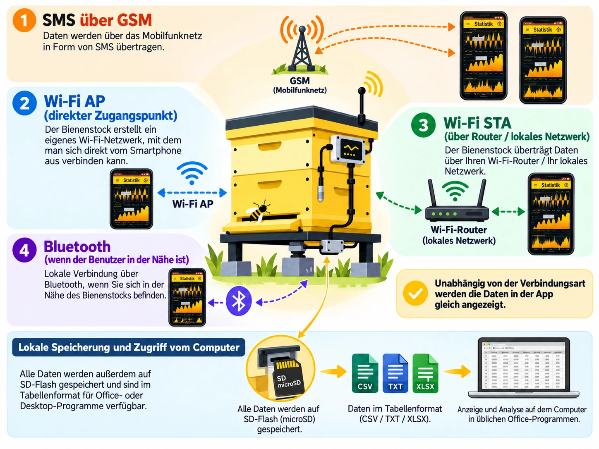

# { .home-brand-logo width="780" height="780" } BeeApiary — Bienenstockwaage und Bienenstandüberwachung { #beeapiary }

BeeApiary verbindet eine Bienenstockwaage mit einem System zur Bienenstandüberwachung und unterstützt GSM, WLAN und Bluetooth. Zusammen mit Sensoren und der App hilft die Waage, den Zustand der Bienenstöcke zu beobachten, Veränderungen zu untersuchen und sowohl am Bienenstand als auch aus der Ferne ein Journal zu führen. Die App lässt sich auch eigenständig ohne Waage verwenden.

!!! note "Waagenmodelle"
    - [Bienenstockwaage mit GSM, Wi-Fi und Bluetooth](https://www.olx.ua/d/obyavlenie/vagi-paschn-apiary-scales-vesy-pasechnye-vesy-gsm-wi-fi-dlya-paseki-IDUTO1F.html)
    - [Bienenstockwaage mit GSM, Wi-Fi und Bluetooth und einem „kleinen Plus“](https://www.olx.ua/d/obyavlenie/vesy-pasechnye-vesy-gsm-wi-fi-dlya-paseki-IDZ7kfw.html "Das „kleine Plus“ ist das kreuzförmige Untergestell")

{ width="1448" height="1086" loading="eager" }

!!! note "Zusätzliche Videomaterialien"
    - [Videos auf dem YouTube-Kanal von BeeApiary](https://www.youtube.com/@beeApiary)

Eine Einheit kann eigenständig als BeeApiary-Bienenstockwaage arbeiten und bildet zusammen mit Sensoren und der App einen intelligenten BeeApiary-Bienenstock. Mehrere solcher Bienenstöcke, die in der App mit einem digitalen Journal zusammengeführt werden, bilden einen intelligenten BeeApiary-Bienenstand. Verschiedene Möglichkeiten des Datenzugriffs, langfristige Notizen, Messungen und Ereignisse ergeben ein umfassendes Bild vom Leben am Bienenstand und helfen dir, deine Bienen besser zu verstehen.

## Deine Daten bleiben unter deiner Kontrolle

- Alle Daten werden lokal gespeichert. Es besteht keine zwingende Verbindung zu externen Servern, daher ist keine SIM-Karte erforderlich. ([Messwertarchiv herunterladen](guides/download-archive.md))
- Die Daten sind direkt am Bienenstand über ein lokales WLAN verfügbar, daher ist keine SIM-Karte erforderlich. ([Mit dem Zugangspunkt der Waage verbinden](guides/configure-local-wifi.md))
- Der Fernzugriff über das Internet ist über das lokale WLAN am Bienenstand möglich. Eine separate SIM-Karte für jedes Gerät ist nicht erforderlich. ([Übertragung über das WLAN-Netzwerk am Bienenstand einrichten](guides/configure-wifi-sync.md))
- Du kannst Daten direkt über Bluetooth abrufen, wenn du dich in der Nähe des Geräts befindest. Die Synchronisierung erfolgt automatisch, daher ist keine SIM-Karte erforderlich. ([Bluetooth-Synchronisierung einrichten](guides/configure-bluetooth-sync.md))
- Der Zugriff über einen Mobilfunkanbieter bleibt ebenfalls möglich und erfordert kein mobiles Internet. Dafür genügt eine SIM-Karte mit einem minimalen Tarif. ([GSM und SMS einrichten](guides/configure-gsm.md))

[Übertragungswege zur App vergleichen](system/connectivity.md)

## Erste Schritte

- [System einrichten](quick-start/full-system.md)
- [App installieren](quick-start/app-only.md)
- [GSM-Verbindung zum Gerät einrichten](quick-start/gsm.md)
- [Mit dem lokalen WLAN verbinden](quick-start/local-wifi.md)

## Dokumentation nach Bedarf

- [BeeApiary-App verwenden](app/index.md)
- [BeeApiary-Bienenstockwaage installieren](device/installation.md)
- [Daten übertragen und speichern](system/index.md)
- [Anleitungen](guides/index.md)
- [Fehlerbehebung](troubleshooting/index.md)

{ .doc-photo width="1079" height="754" loading="lazy" decoding="async" }
