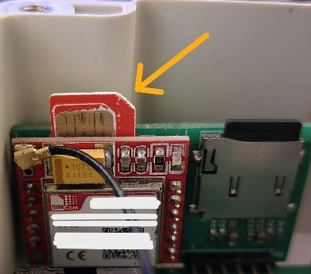
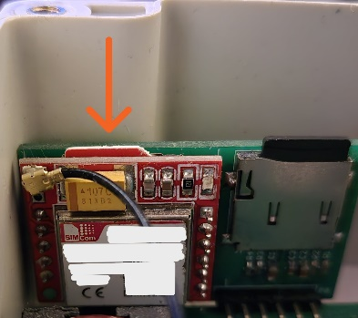

# System einrichten

!!! danger "Achtung: Das Gerät ist bereits vollständig eingerichtet"
    Ein neues BeeApiary-Messgerät wird eingerichtet und kalibriert geliefert. Die Rufnummer des Benutzers ist bereits im Gerät gespeichert, daher musst du es nicht zusätzlich konfigurieren.

    Nimm keine Änderungen auf eigene Faust vor. In der Regel reicht es aus, nur die ersten vier Schritte auszuführen, damit alles funktioniert.

    Entferne den Akku nicht, tariere oder kalibriere die Waage nicht und ändere keine Einstellungen, bevor du die entsprechende Anleitung vollständig gelesen hast. Davon wird während der ersten Inbetriebnahme dringend abgeraten.

!!! warning "Vor dem Einsetzen der SIM-Karte"
    Verwende ausschließlich eine micro-SIM und deaktiviere vorher die PIN-Abfrage.

1. Öffne den Deckel der Datenerfassungseinheit.

    { .doc-photo }

2. Setze die micro-SIM in den vorgesehenen Steckplatz ein.

    Richtige Position der Karte:

    { .doc-photo }

    Setze die SIM-Karte ein und drücke sie vorsichtig hinein, bis sie fast vollständig im Steckplatz versenkt ist und mit einem leichten Klicken einrastet:

    { .doc-photo }

3. [Aktiviere das Gerät oder starte es neu](../device/installation.md#activation-reset): Halte den Magnetschlüssel kurz an die Markenkennzeichnung auf der Rückseite der Haupteinheit.

    { .doc-photo }

    { .doc-photo }

4. Warte etwa eine Minute und prüfe, ob die erste SMS an der vorkonfigurierten Rufnummer des Benutzers ankommt.

Fertig. Glückwunsch: Das Gerät erfasst Daten, sendet sie über GSM und speichert ein lokales Archiv.

## App — bei Bedarf

Für den Empfang gewöhnlicher SMS ist die BeeApiary-App nicht erforderlich. Installiere sie, wenn du Gerätedaten automatisch empfangen, Messwerte anzeigen und weitere App-Funktionen verwenden möchtest.

1. [Installiere die BeeApiary-App](app-only.md) und erteile ihr unbedingt die Berechtigung zum Verarbeiten von SMS.
2. Wähle in der App **Gerät hinzufügen**.
3. Gib die Rufnummer der micro-SIM ein, die im BeeApiary-Messgerät eingesetzt ist.

!!! note
    Gib die Rufnummer der im Gerät eingesetzten SIM-Karte ein, nicht die Telefonnummer des Benutzers.

Wenn die erste SMS nicht ankommt, ändere die Einstellungen nicht auf Verdacht. Öffne die Seite [Keine SMS empfangen](../troubleshooting/no-sms.md). Ändere die Rufnummer des Benutzers über die [GSM-Einstellungen](../guides/configure-gsm.md) nur bei Bedarf.

[Video zum Einsetzen der SIM-Karte](https://www.youtube.com/shorts/GF2KLso4DMo)

Weitere Informationen: [GSM und SMS](../system/gsm-and-sms.md) und [Datenfluss](../system/data-flow.md).
