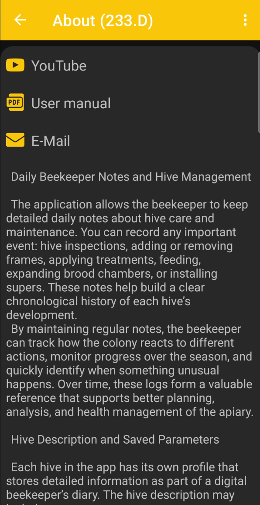

# About the App

The **About the App** page provides a brief overview of BeeApiary, useful links, and details about the installed version.

{ .doc-screenshot }

The page provides access to:

- **YouTube** - video guides for setup and use;
- **User manual** - the BeeApiary text documentation;
- **E-Mail** - contact with support by email;
- a brief overview of the app's features and apiary journal.

## App Version

The version identifier and build date are shown at the bottom of the page.

{ .doc-screenshot }

This information helps you check whether the app is up to date and identify the exact version when contacting support.
