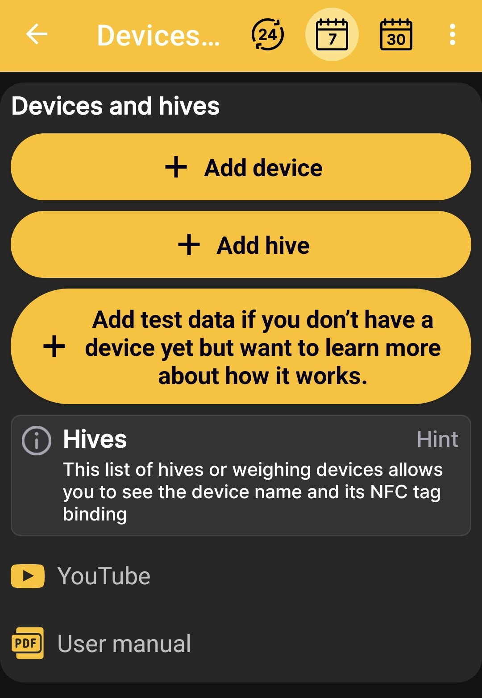

# Add Scales or a Hive

The **Devices and hives** screen allows you to:

- add physical BeeApiary beehive scales to a hive profile;
- create a hive profile without any equipment;
- start a demonstration hive with scales and test data to explore the app.

{ .doc-screenshot }

## BeeApiary Beehive Scales

The **Add device** button creates a hive profile linked to physical BeeApiary beehive scales. This profile can automatically receive weight, temperature, and other available readings.

Continue with [Add BeeApiary Beehive Scales](../add-device.md). You can compare GSM, a direct Wi-Fi connection, the apiary Wi-Fi network, and Bluetooth under [Receiving Data in the App](../../system/connectivity.md).

## Hive Without Scales

The **Add hive** button creates a separate profile without physical scales. You can use it to keep a journal, describe the [hive status](../hive-state.md), add notes, and record [events](../events-and-notes.md).

Continue with [Add a Hive](../add-hive.md).

## Test Hive with Simulated Scales

The **Add test data** button creates a demonstration hive with simulated beehive scales. The app generates data similar to real readings, allowing you to explore the home screen, charts, hive status, and events and work with them as you would with a profile linked to real smart scales.

Test values are provided only to demonstrate the app and are not real measurements.

## Additional Instructions

Links to YouTube video instructions and the user manual appear at the bottom of the screen. Use them to continue from the initial scenario selection to detailed setup guidance.
