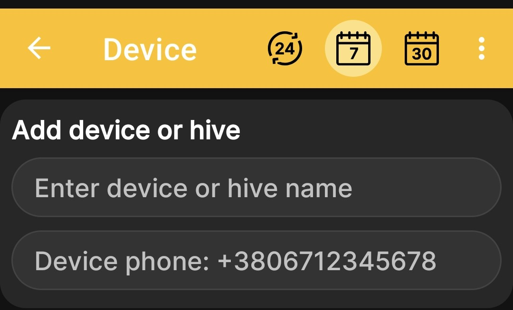
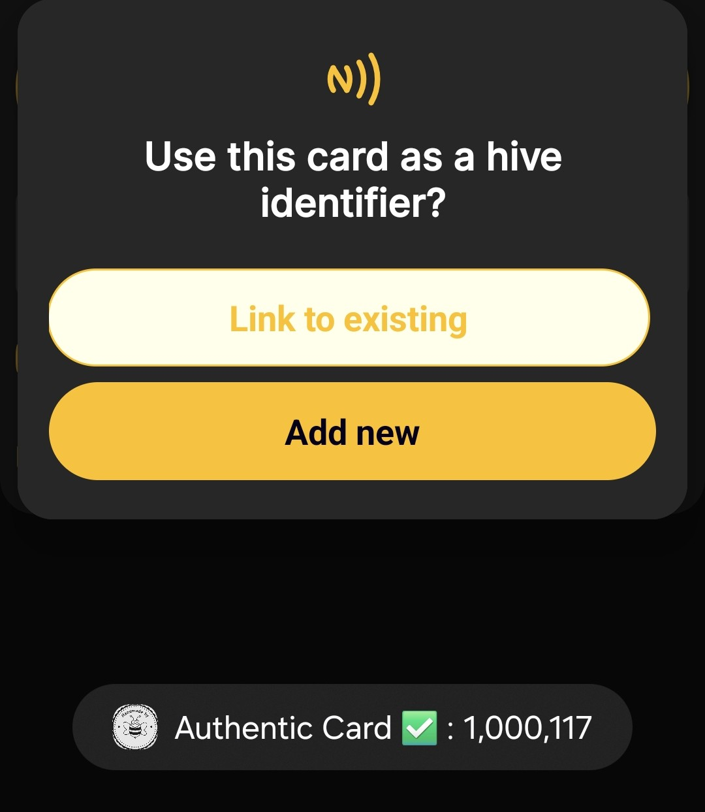
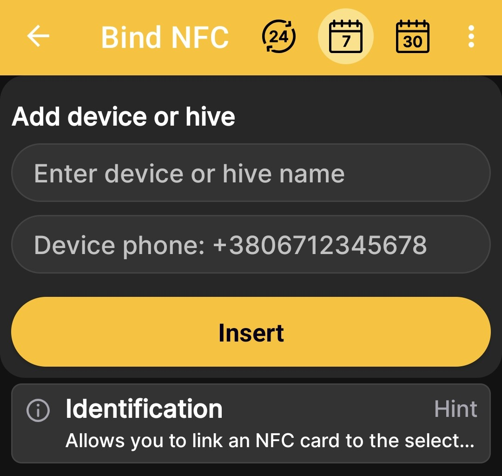

# Add BeeApiary Beehive Scales

Add BeeApiary beehive scales to link a hive profile to physical equipment and receive automatic readings. The available data channels and their requirements are described under [Receiving Data in the App](../system/connectivity.md).

## Add the Scales

1. Open **Main menu → Add device or hive**.
2. On the **Devices and hives** screen, tap **Add device**.
3. Enter a clear name for the hive or beehive scales.
4. If you plan to receive data via GSM, enter the number of the SIM card installed in the beehive scales.

    { .doc-screenshot }

5. Tap **Insert**.

After saving, the profile appears in the list of devices and hives. Data from the physical scales will appear after setup and the first successful exchange through one of the [supported channels](../system/connectivity.md).

## Add Using an NFC Card

You can add the beehive scales when the app recognizes an NFC card. In this case, the app creates the profile and links the card to it at the same time.

1. Hold the NFC card near the phone.
2. When asked whether to use the card as a hive identifier, select the required action:
   - **Link to existing** — select a profile that has already been created;
   - **Add new** — create a new profile with this NFC link.

    { .doc-screenshot }

3. After selecting **Add new**, enter a name and, for GSM, the number of the SIM card installed in the beehive scales.
4. Tap **Insert**.

    { .doc-screenshot }

For more information about hive identification and available actions, see [NFC Tags and Actions](nfc-settings.md).
