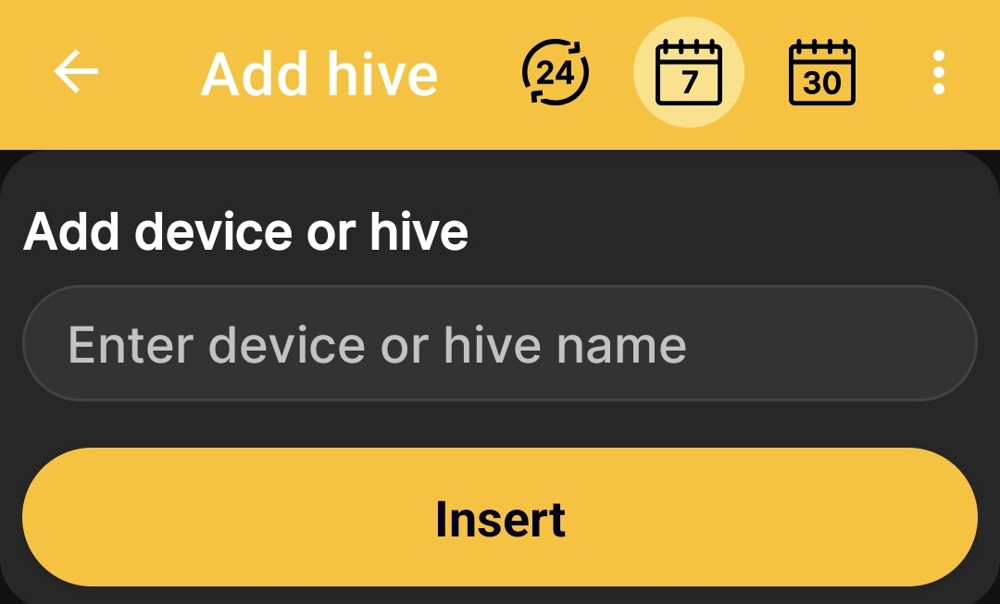

# Add a Hive

Create a hive profile without physical beehive scales to keep its journal, record its status, add notes, and save planned and completed events. This scenario does not require beehive scales, a SIM card, or permission to process SMS.

1. Open **Main menu → Add device or hive**.
2. On the **Devices and hives** screen, tap **Add hive**.
3. Enter a name that will help you find this hive easily.
4. Tap **Insert**.

    { .doc-screenshot }

After saving, the profile appears in the shared list of devices and hives. Use [Hive Status](hive-state.md) and [Events and Notes](events-and-notes.md) to build its history over time.
