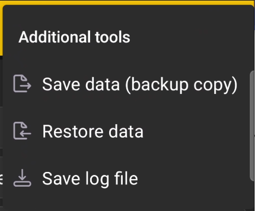

# Additional Tools

The **Additional tools** submenu contains commands for backing up data and service diagnostics.

{ .doc-screenshot }

| Command | Purpose |
|---|---|
| **Save data (backup copy)** | Creates a backup copy of the app database. |
| **Restore data** | Restores app data from a previously created backup copy. |
| **Save log file** | Saves a service log file that you can send to support for diagnostics. |

!!! warning "Keep an up-to-date backup copy"
    Before restoring, make sure you have selected the required copy of the data. Save the current backup separately if you may need to restore it later.
