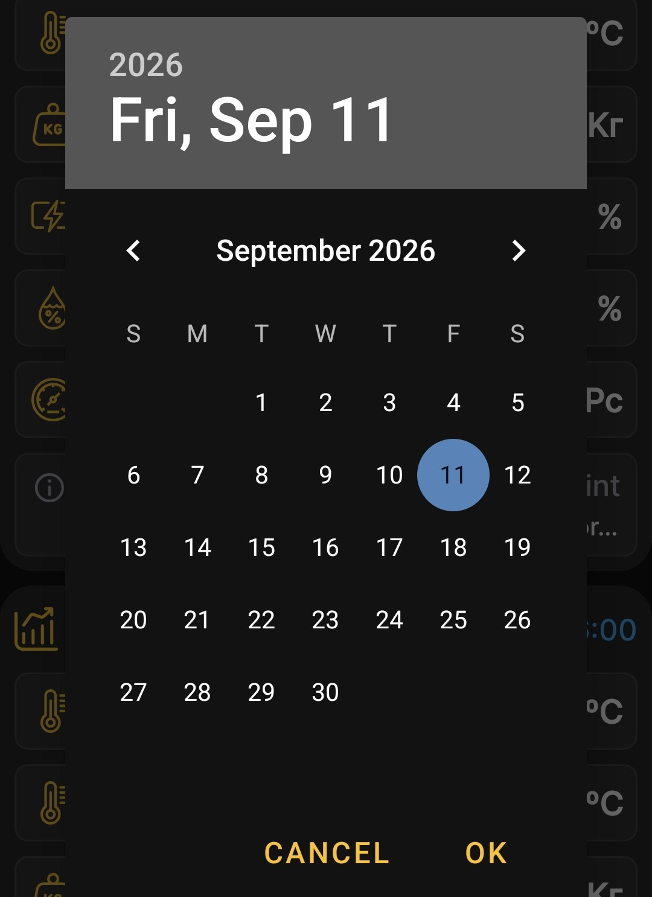

# Chart Viewing Period

Briefly tap the selected hive heading on the home screen to open the charts.

## Period Length

The day, week, and month icons set the period unit. Tap the relevant icon repeatedly to select 1, 2, 3, or more days, weeks, or months in sequence.

## End Date

Tap the date and time at the top of the selected hive panel, then choose the required date in the calendar. This is the end date of the interval; the app calculates the start date from the selected period length.

For example, if you select **September 4** as the end date and **one month** as the period, the charts show data from **August 4 through September 4**.

{ .doc-screenshot }

You can choose any available end date, including a date from a year ago. This lets you review older measurements and events when the corresponding data is available in the app.

After you make a selection, the app rebuilds the [charts](charts.md) for the selected interval.
