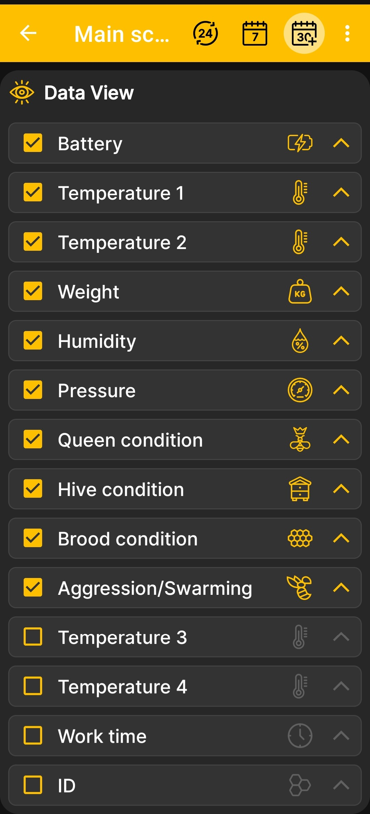

# Select Data and Charts

The **Main screen order** screen determines both which tiles appear and their order on the home screen, and which charts appear and their order on the charts screen. Charts are available only for numeric values that change over time.

1. Open **Main Menu → Settings → Main screen order**.
2. Select the checkboxes next to the data you want to display.
3. Clear the checkboxes for tiles you do not need.
4. Use the arrows on the right to move the most important values higher.

{ .doc-screenshot }

After you return to the [home screen](main-screen.md), the app uses the selected set and order of tiles. On the [charts](charts.md) screen, the same settings determine which charts are available for the selected numeric values and their order.

Detailed hive state fields are configured [on a separate screen](hive-state-settings.md). Event visibility and the order in which events and charts are drawn are controlled in the [additional app settings](additional-settings.md).
