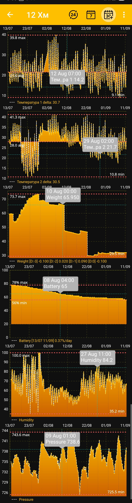

# Charts

Charts are created for numeric readings that change over time, such as weight, temperature, humidity, pressure, and battery charge. Text descriptions of hive state remain separate blocks on the [home screen](main-screen.md), while [events](events-and-notes.md) can appear as time markers over the charts.

After you select a period and end date, the app rebuilds the active charts for that interval:

{ .doc-screenshot }

## Interactive Viewing

- Tap a point on a chart to display its exact time and value in a tooltip.
- Zoom or stretch the charts with gestures to examine a specific part of the period in greater detail.
- Minimum and maximum markers help you assess the range at a glance.
- Temperature charts also show the average value for the period.
- Humidity and atmospheric pressure charts can show recommended values.
- The battery chart shows the critical discharge level and daily charge change.

Events created for the selected hive can appear together with the measurements at their corresponding times. This helps you compare apiary work with changes in weight, temperature, and other readings. Event visibility and layer order are configured under [Additional App Settings](additional-settings.md).

The available charts and their order depend on the selected tiles and display settings:

- [Select the period and end date](chart-period.md)
- [Select data, charts, and their order](chart-settings.md)

Additional indicators and viewing tools may be expanded in future versions of the app.
