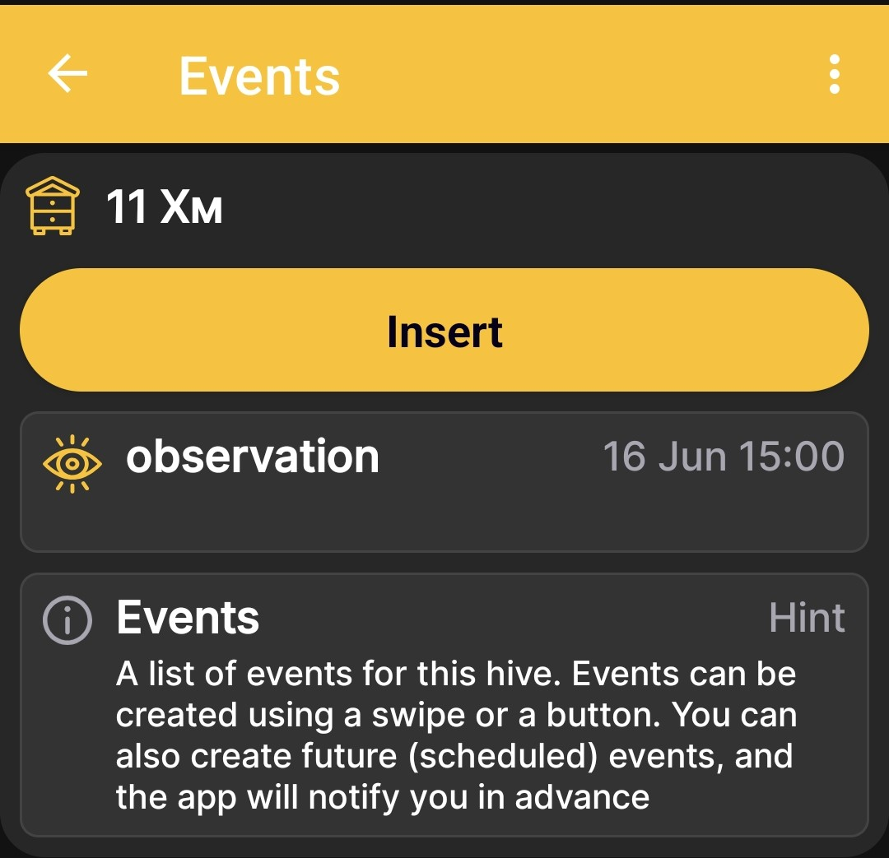
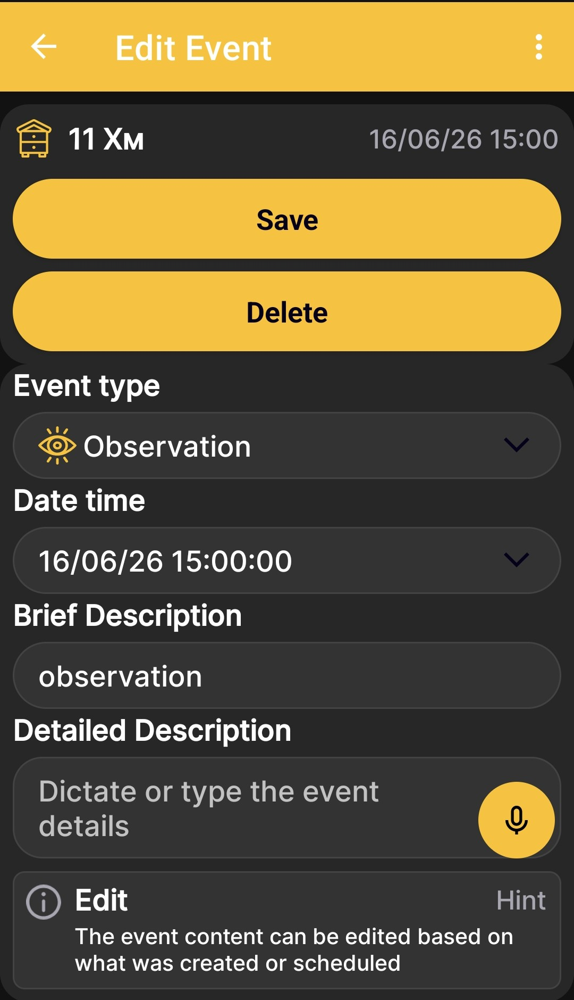
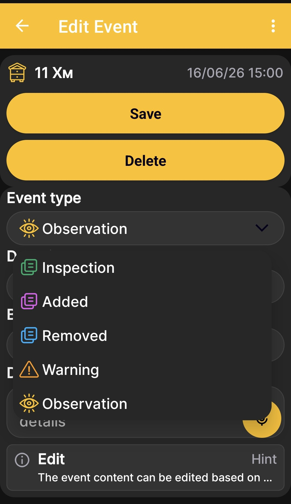

# Events and Notes

Events help you maintain a history of work, inspections, and observations for each hive. To open the event list from the [app home screen](main-screen.md), swipe right.

## Event List

The screen shows the selected hive and its saved events. Each entry contains a type icon, name, color marker, and date and time. Tap **Insert** to create an event, or select an existing entry to edit it.

{ .doc-screenshot }

You can also create future scheduled events. The app notifies you in advance so that planned work does not get lost among current records.

## Adding or Editing an Event

{ .doc-screenshot }

| Element | Purpose |
|---|---|
| **Event type** | Determines the purpose, icon, and color marker of the entry. |
| **Date time** | Records when the event occurred or when planned work is due. |
| **Brief Description** | Gives the completed or planned action a short name. |
| **Detailed Description** | Stores additional information, inspection results, or a note. |
| **Save** | Saves a new event or your changes. |
| **Delete** | Deletes the open event. |

!!! note "Voice Input"
    A field marked with a microphone icon supports dictation. The app converts your speech to text that you can edit, search, and copy later. It does not save an audio recording.

## Event Types

{ .doc-screenshot }

| Type | When to Use It |
|---|---|
| **Inspection** | To record the results of a hive inspection. |
| **Added** | To indicate that something was added to the hive. |
| **Removed** | To indicate that something was removed from the hive. |
| **Warning** | For events that require special attention. |
| **Observation** | To record an observed condition or occurrence. |

Event types have different colors and icons. On the [charts](charts.md), events appear with timestamps and are positioned according to when they occurred. This helps you compare apiary work with changes in weight, temperature, and other measurements.
