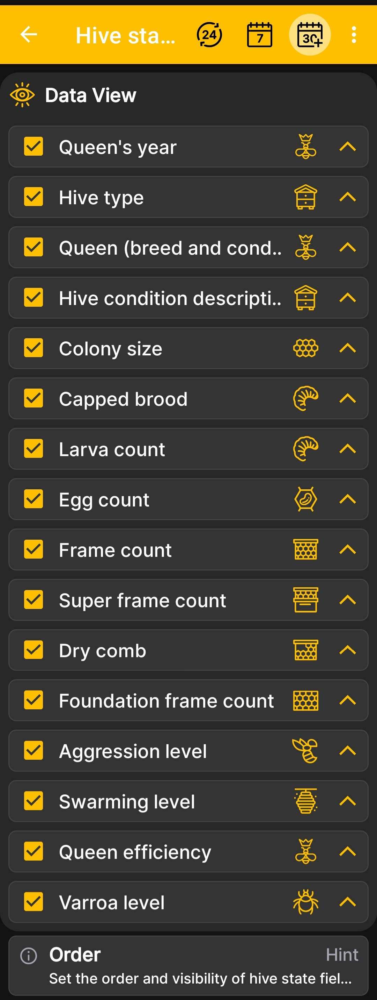

# Hive State Field Order

This screen controls the visibility and order of fields in the expanded [hive state](hive-state.md).

1. Open **Main Menu → Settings → Hive state fields order**.
2. Keep the checkboxes selected next to the information you want to display.
3. Clear the checkboxes for fields that are not used at your apiary.
4. Use the arrows on the right to move more important fields higher.

{ .doc-screenshot }

You can configure the display of the queen's year and condition, hive type and description, colony size, brood, larvae, eggs, different frame types, aggression, swarming, queen productivity, and varroa level.

Changing the order affects how the data is presented in the app, but it does not change the stored hive records.
