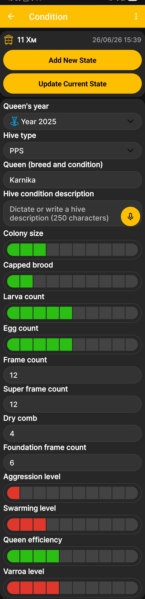

# Hive State

Hive state lets you record inspection results, including information about the queen, colony strength, brood, frames, and other important indicators. To open this screen from the [app home screen](main-screen.md), swipe left.

{ .doc-screenshot }

## Adding and Updating the Hive State

The selected hive and the date and time of the record appear at the top of the screen.

- **Add New State** creates a separate hive state record for the selected date and time.
- **Update Current State** saves changes to the current record without creating another state.

## Hive State Fields

| Field | What to Enter |
|---|---|
| **Queen's year** | The year when the queen was reared or introduced. |
| **Hive type** | The hive construction from the configured list of [hive types](hive-types.md). |
| **Queen (breed and condition)** | The queen's breed and a brief assessment of her current condition. |
| **Hive condition description** | A free-form description of the inspection results. |
| **Colony size** | A relative assessment of colony strength using the scale. |
| **Capped brood** | A relative assessment of the amount of capped brood. |
| **Larva count** | A relative assessment of the number of larvae. |
| **Egg count** | A relative assessment of the number of eggs. |
| **Frame count** | The total number of frames in the hive. |
| **Super frame count** | The number of installed super frames. |
| **Dry comb** | The number of frames with drawn comb. |
| **Foundation frame count** | The number of frames fitted with foundation. |
| **Aggression level** | A relative assessment of colony aggression. |
| **Swarming level** | A relative assessment of the colony's swarming state. |
| **Queen efficiency** | A relative assessment of the queen's performance. |
| **Varroa level** | A relative assessment of varroa infestation. |

Fields with a scale are intended for relative assessments, while the frame fields accept counts. Enter only the information required for the way you manage your apiary.

!!! note "Voice Input"
    You do not have to type in a field marked with a microphone icon. Dictate the description, and the app converts your speech to text. This creates editable, searchable, and copyable text rather than saving an audio file.

The [Hive State Field Order](hive-state-settings.md) menu determines which fields appear on the screen and in what order.
