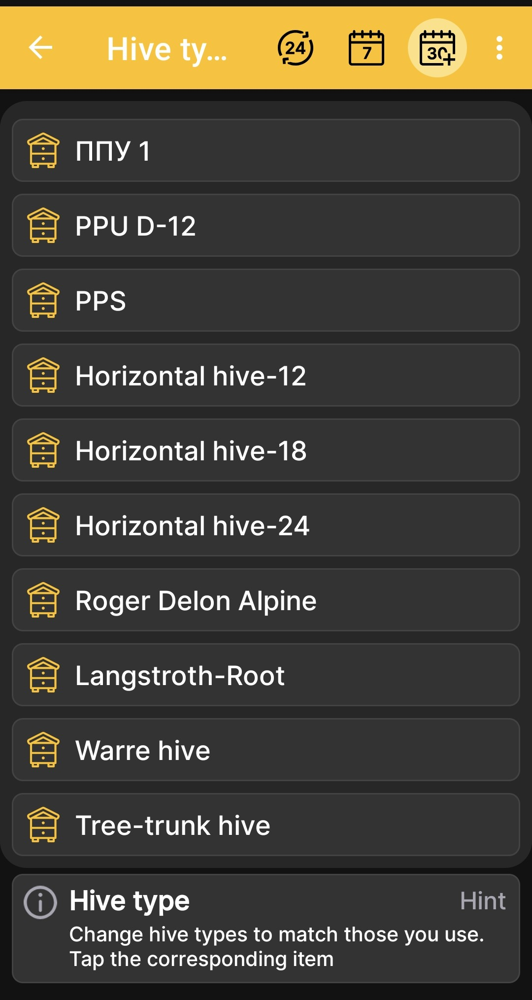

# Hive Types

The **Hive types** screen lets you adapt the list of hive body types to those used at your apiary. The app includes several sample types, but the initial list is not intended to cover every hive design.

Most apiaries use between one and five hive body types, so the initial list provides some extra capacity for typical use. You can freely change the existing types or extend the list to match your apiary.

1. Open **Main Menu → Settings → Hive types**.
2. Find the required type in the list.
3. Tap its tile to configure how it is used in the app.

{ .doc-screenshot }

This setting belongs to hive descriptions in the app and does not change the hardware configuration of the BeeApiary beehive scales.
