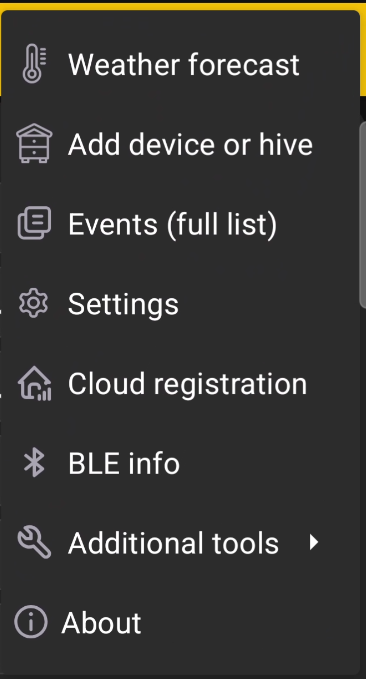

# Main Menu

Open the menu in the upper-right corner of the main screen to access the app's general features.

{ .doc-screenshot }

| Menu item | Purpose |
|---|---|
| **Weather forecast** | Shows the weather forecast for apiary work. |
| **Add device or hive** | Opens the option to add [BeeApiary hive scales](add-device.md) or a separate [hive profile](add-hive.md). |
| **Events (full list)** | Opens [events and notes](events-and-notes.md) for all hives. |
| **Settings** | Opens the general [app settings](settings/index.md). |
| **Cloud registration** | Prepares the device for [synchronization via the apiary Wi-Fi network](../guides/configure-wifi-sync.md). |
| **BLE info** | Opens information about [synchronization via Bluetooth](../system/bluetooth.md). |
| **Additional tools** | Opens [backup, restore, and service log export tools](additional-tools.md). |
| **About** | Shows the [description, useful links, and installed version](about.md). |
