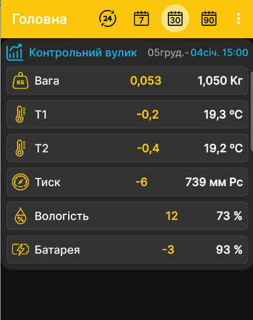

# App Home Screen

The home screen shows the device name, latest values, measurement date and time, and the change over the selected period. Tap the heading briefly to open charts, or press and hold it to open settings.

{ .doc-screenshot }

- [Installation](installation.md)
- [Measurements](measurements.md)
- [Charts](charts.md)
- [Settings](settings.md)

You can check the app version and contact information on the **About** page:

{ .doc-screenshot }
