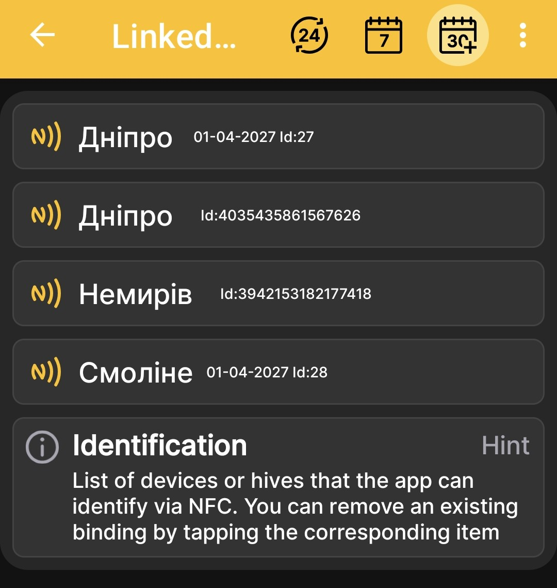
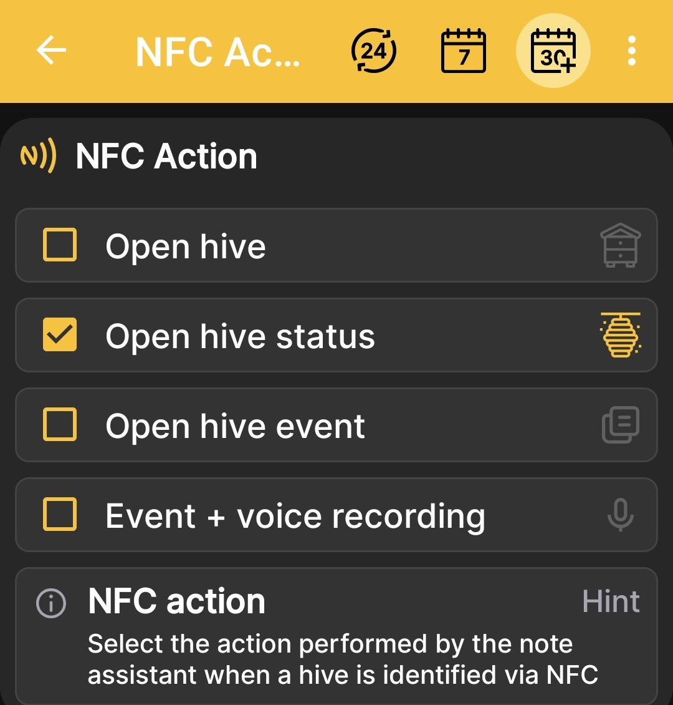

# NFC Tags and Actions

NFC settings consist of two related screens: the list of linked tags and the action the app performs after recognizing a hive.

## What Is an NFC Tag?

An NFC tag is a small electronic identifier. It can be a key fob, coin, sticker, standard NFC card, or a special hive card. Attach the tag to the hive in a convenient place for scanning, such as under the roof or on a wall.

When you hold an NFC-enabled phone near the tag, the app quickly identifies the specific hive and performs the selected action: it opens the hive details, status, or events, or immediately starts creating an event using voice input.

You only need to link a compatible tag to the hive profile once and leave it on the hive. This reduces the time needed to find the correct profile and helps maintain a more complete history without separate paper notes.

!!! info "A Voice Note Becomes Text"
    The app does more than save a voice recording: it converts the dictated note into text. This is especially convenient when working in protective gloves, during breeding work, or while inspecting many hives in sequence. You can later review, search, process, and copy the text whenever needed.

## Linked NFC Tags { #linked-nfc-tags }

Open **Main Menu → Settings → NFC tags list** to view the devices or hives that the app can identify via NFC.

{ .doc-screenshot }

The list shows the name and identifier of each linked profile. Tapping the corresponding tile removes the NFC link.

!!! info "Devices and Hives List"
    In the devices and hives list, a separate NFC icon indicates that a tag is linked. A direct link to the complete description of this screen will be added after its review is complete.

## Action After Recognition { #nfc-action }

Open **Main Menu → Settings → NFC Action** and select what the app should open after recognizing an NFC tag.

{ .doc-screenshot }

Available actions:

- **Open hive**;
- **Open hive status**;
- **Open hive event**;
- **Event + voice recording**.

The last option immediately opens event creation with voice input after the hive is identified.
