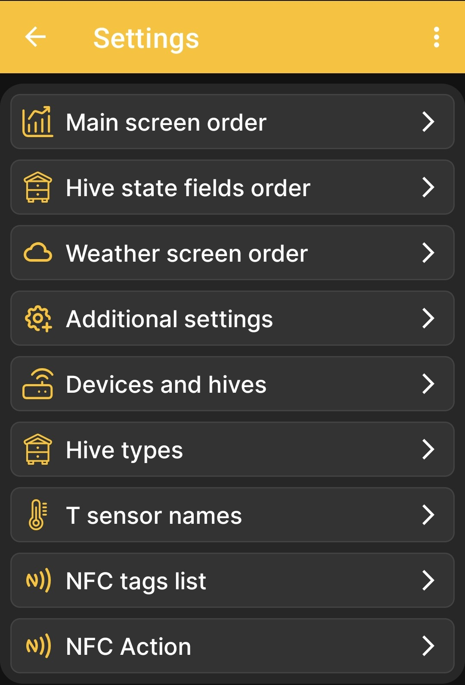

# App Settings

The **Settings** page is the parent menu for the app's display and behavior options. Each item opens a separate child screen.

{ .doc-screenshot }

| Menu item | Purpose |
|---|---|
| **Main screen order** | Opens [data and chart selection](../chart-settings.md). These settings determine which tiles appear and their order on the home screen and, for numeric values, which charts appear and their order on the charts screen. |
| **Hive state fields order** | Opens the [hive state field settings](../hive-state-settings.md). |
| **Weather screen order** | Opens the [weather forecast data settings](../weather-settings.md). |
| **Additional settings** | Opens [additional app behavior options](../additional-settings.md), including event display and Bluetooth operation. |
| **Devices and hives** | Manages the list of profiles. Adding [BeeApiary beehive scales](../add-device.md) and [a hive](../add-hive.md) are described separately; a complete description of this screen is still being prepared. |
| **Hive types** | Opens the [list of hive types](../hive-types.md) used at the apiary. |
| **T sensor names** | Lets you assign clear names to temperature channels. A detailed description will be added after a separate review of this screen. |
| **NFC tags list** | Shows [devices and hives linked via NFC](../nfc-settings.md#linked-nfc-tags). |
| **NFC Action** | Selects the [action performed after an NFC tag is recognized](../nfc-settings.md#nfc-action). |

## Related Settings

Configuration of the BeeApiary beehive scales through their local web interface is described separately: [Direct Wi-Fi Connection to the Device](../../system/local-wifi.md#direct-access-point).

- [Set Up Synchronization via the Apiary Wi-Fi Network](../../guides/configure-wifi-sync.md)
- [Set Up Synchronization via Bluetooth](../../guides/configure-bluetooth-sync.md)
