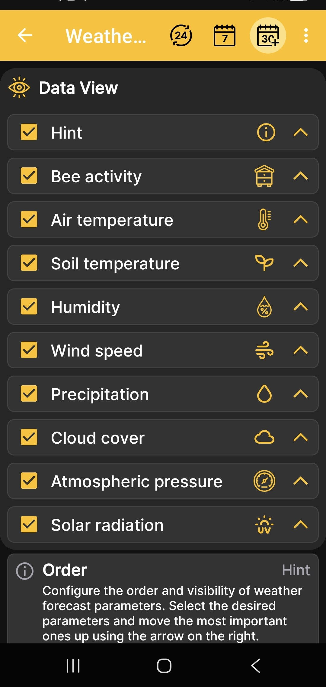

# Weather Screen Data Order

This screen determines which data the weather forecast displays and the order in which it appears.

1. Open **Main Menu → Settings → Weather screen order**.
2. Select or clear the checkboxes next to the required values.
3. Use the arrows on the right to move the most important data higher.

{ .doc-screenshot }

Available values include the hint, bee activity, air and soil temperature, humidity, wind speed, precipitation, cloud cover, atmospheric pressure, and solar radiation.

This setting applies to the weather forecast in the Android app. It does not enable or disable the physical sensors of the BeeApiary beehive scales.
