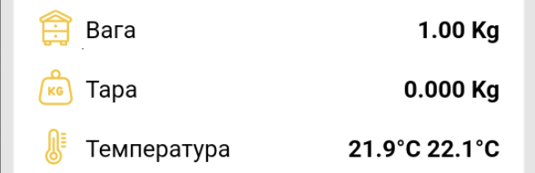
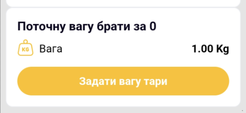

# Calibration and Tare

!!! danger "A new device does not need calibration"
    Calibration is primarily required after a repair or loss of factory calibration data. Do not use it as a general way to troubleshoot an incorrect weight reading.

## Calibration

1. Disconnect the external power supply.
2. Place all weight sensors on a firm, level surface and leave the platform empty.
3. Connect to the device access point and open **General Settings → Scale Settings** in its web interface.

    { .doc-screenshot }

4. Start **Zero Calibration** and wait for it to finish without touching the platform.

    The screen shows two calibration stages:

    { .doc-screenshot }

    { .doc-screenshot }

5. Select an available reference weight of 500, 1000, or 5000 g and place it on the platform.

    { .doc-screenshot }

6. Start **Reference Calibration** and wait for the result.

    { .doc-screenshot }

    { .doc-screenshot }

## Tare

You can enter a known tare weight in grams:

{ .doc-screenshot }

Alternatively, accept the current platform weight as zero:

{ .doc-screenshot }

Taring does not change the factory calibration factor.

Separate procedures: [Tare the Scales](../guides/tare-scales.md) and [Calibrate the Scales](../guides/calibrate-scales.md).
