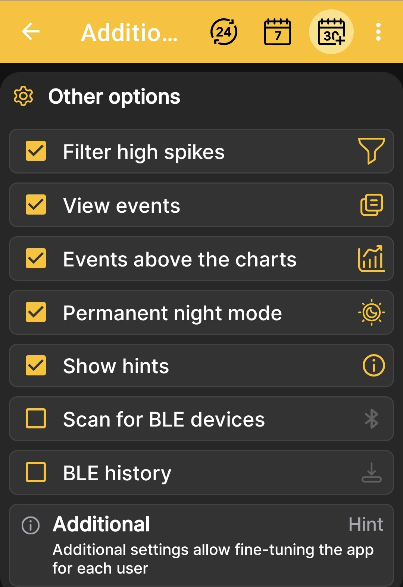
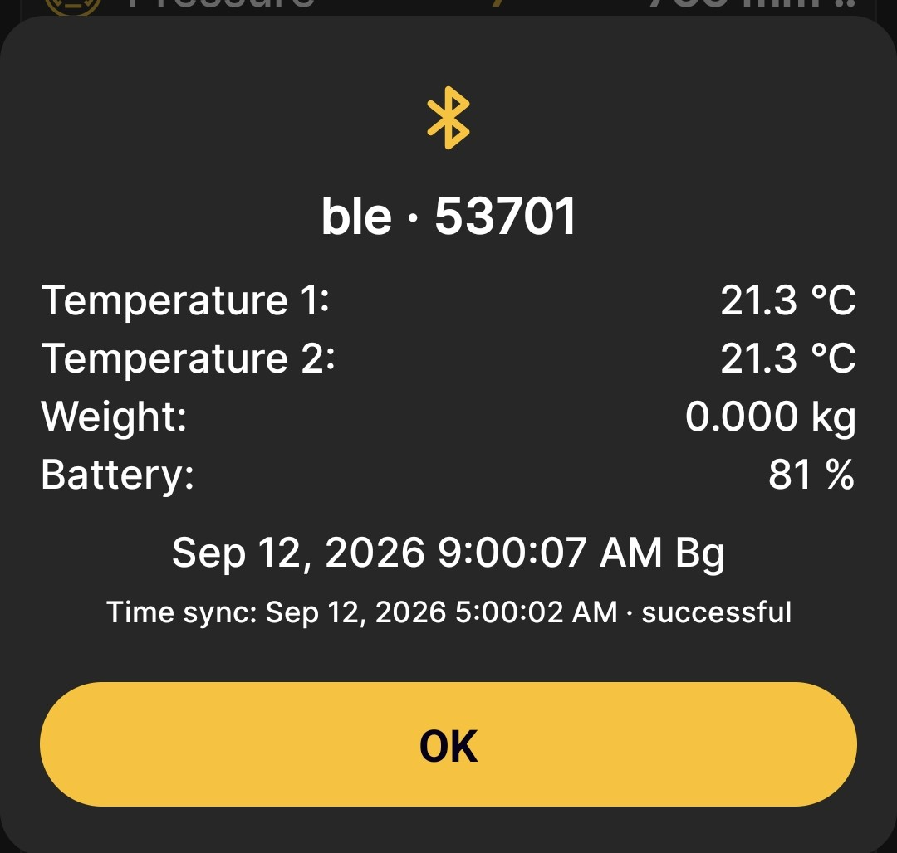

# How to Set Up Bluetooth Synchronization

!!! danger "Device compatibility"
    This feature is supported only by devices manufactured after August 2026. Devices manufactured earlier can also gain this functionality, but they must be updated at the factory. There is currently no simple patch that you can install yourself.

This procedure sets up automatic data retrieval from BeeApiary beehive scales while the phone is nearby. Synchronization does not require a SIM card or Internet access.

## Before you begin

1. Make sure the scales meet the compatibility requirements above.
2. [Synchronize the scales' clock](../system/time-synchronization.md) with the phone. The difference must not exceed two minutes.
3. Turn on Bluetooth on the phone.
4. Grant the app all requested permissions, including Bluetooth permissions.
5. Allow the app to run in the background and wake up at the required time. Review the current [app installation recommendations](../app/installation.md).

!!! warning "Check the time before setup"
    If the difference exceeds two minutes, the scales may become available before or after the phone starts listening, preventing automatic synchronization.

## Enable BLE info on the scales

1. [Connect to the scales' access point](configure-local-wifi.md).
2. Open `http://192.168.4.1` and select **Additional settings**.
3. Select **BLE info** and save the changes.

This option and the other switches are explained under [Additional Device Settings](../system/additional-settings.md).

## Enable synchronization in the app

4. Open the app's main menu, go to **Settings**, and open **Additional settings**.
5. Enable **Scan for BLE devices** so that the app can find nearby scales and receive measurements.
6. Enable **BLE history** so that the app also retrieves the stored history, including data from the previous day.

    { .doc-screenshot }

    !!! warning "Enable the required options"
        The screenshot is a general example, so both Bluetooth switches are shown as disabled. **Scan for BLE devices** must be enabled for synchronization. Enabling **BLE history** is also recommended so the app can retrieve the available history and restore missed measurements.

    For a complete description of this screen, see [Additional App Settings](../app/additional-settings.md).

7. Return to the app's home screen. Keep Bluetooth enabled and the phone within reliable Bluetooth range during the next hourly cycle.

## Check the result

Synchronization occurs only when **BLE info** is enabled on the scales and Bluetooth and the corresponding app options are enabled on the phone. The scales become available for communication during a scheduled wake-up or after [activation with the magnetic key](../device/installation.md#activation-reset).

The app can exchange data while it is open or in the background if Android allows it to run and wake up at the required time.

8. Wait for a message confirming that data has been received.

    { .doc-screenshot }

    This window shows:

    - the hive name and scales number;
    - the latest available set of measurements for the scales' configuration;
    - the date and time of the received measurement;
    - the time and result of clock synchronization.

    When connecting to scales that have not yet been registered, an **Add device** button may also appear. Use it to complete the standard [procedure for adding BeeApiary beehive scales](../app/add-device.md) once. The app will then recognize them automatically.

9. Tap **OK**. If necessary, open the latest message again through **BLE Info** in the main menu.
10. Make sure the new values appear on the app's home screen and charts.

Done: while the phone is nearby, the app will automatically retrieve available data. If the connection was unavailable for several hours, enabled **BLE history** can restore the missed measurements during the next successful synchronization, within the available history depth of one day to one week.

For more information about how it works, see [Bluetooth Data Synchronization](../system/bluetooth.md).
