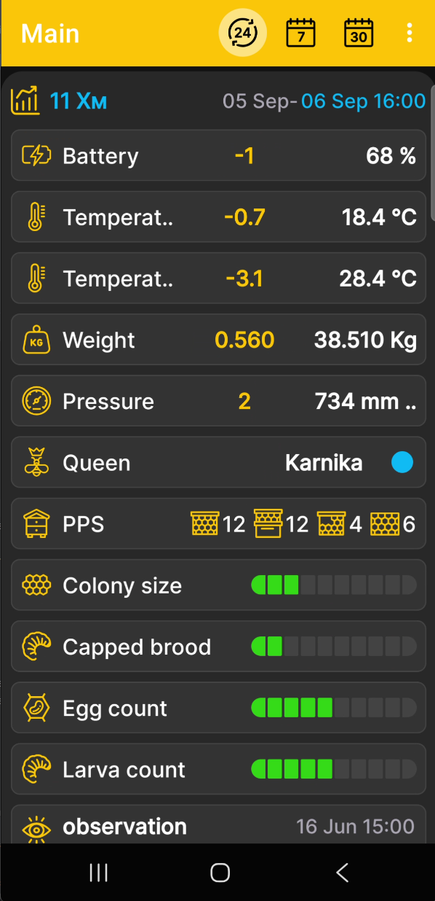

# How to Download the Archive

Before you begin, make sure the BeeApiary app is up to date through Google Play and the beehive scales are running firmware released in August 2024 or later. If the installed version is older or you are unsure of its date, follow [Update the BeeApiary Beehive Scales Firmware](update-device.md).

Manual archive download is useful when the scales have no SIM card, other synchronization methods are temporarily unavailable, or gaps appear in the measurements. The app imports the stored data and adds it to the local history.

!!! warning "microSD and battery charge"
    A working microSD card containing available data must be installed in the scales. A direct Wi-Fi connection keeps the scales active and increases power consumption, so do not perform this procedure more than once a day unless necessary.

1. [Activate or restart the BeeApiary beehive scales](../device/installation.md#activation-reset) with the magnetic key.
2. Within the available interval, usually about one minute, connect the phone to `apiary_net` and remain near the scales.
3. Open the BeeApiary app.
4. Wait for the app to detect the nearby scales automatically.
5. In the **"Device nearby. Download archive?"** prompt, tap **Yes**.

    { .doc-screenshot }

6. Wait for the import to finish, then immediately disconnect the phone from `apiary_net`. Once disconnected, the scales can enter sleep mode and avoid unnecessary battery drain.
7. View the downloaded data using the app's standard screens.

    { .doc-screenshot }

After confirmation, the app downloads the archive automatically and stores a local copy of the measurements. If other channels missed some data, the archive can fill the corresponding gaps in the history. The archive format and retention period are described under [Data Storage](../system/data-storage.md).
