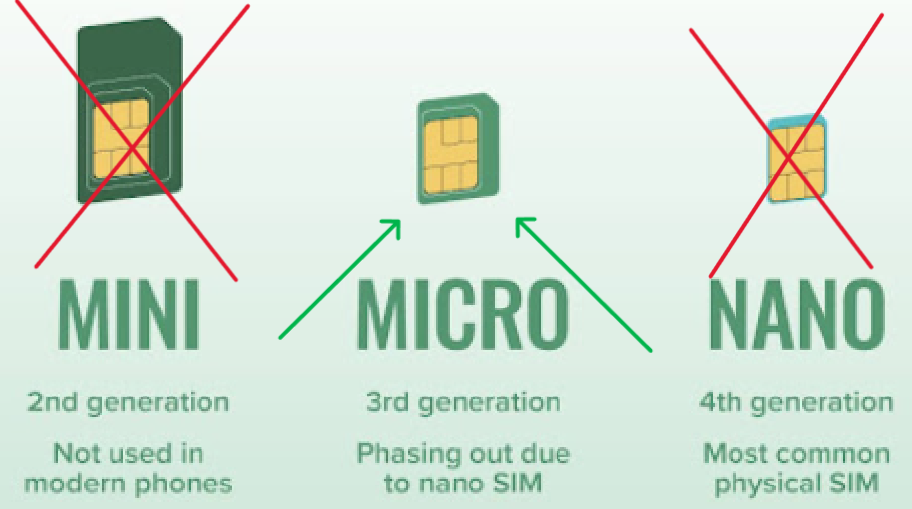

# How to Set Up a New BeeApiary Measuring Device

1. Charge the device through USB Type-C.

    !!! note "Choosing a charger and cable"
        The device does not support fast charging, including USB Power Delivery (PD). Use a standard power source with a USB Type-A port and a USB Type-A–USB Type-C cable. A USB Type-C–USB Type-C cable is not recommended for charging.

2. Install the device and sensors according to the [placement guidelines](../device/placement.md).
3. Insert a micro-SIM with PIN protection disabled.

    Use the micro-SIM format:

    { .doc-photo }

    Correctly installed card:

    { .doc-photo }

    Insert the SIM card and gently press it almost completely into the slot until you hear a soft click confirming that it is locked in place:

    { .doc-photo }

4. Activate or restart the device: briefly hold the magnetic key against the branded mark on the back of the main unit.

    { .doc-photo }

    { .doc-photo }

    For more information, see [Activation and Restart](../device/installation.md#activation-reset).

5. Connect to `apiary_net` and open `http://192.168.4.1`.
6. Enter the owner's phone number in international format.
7. Disconnect from `apiary_net` and check the first SMS message.

Result: the device collects measurements, sends them to the owner, and stores an archive.
