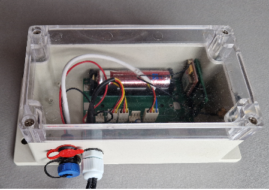

# System Setup

!!! danger "Attention: the device is already fully configured"
    A new BeeApiary measuring device is supplied configured and calibrated. The user number is already stored in the device, so you do not need to reconfigure it.

    Do not make changes on your own. Usually, you only need to complete the first four steps below for everything to work.

    Do not remove the battery, tare or calibrate the scales, or change any settings without first reading the relevant instructions to the end. Doing so during initial setup is strongly discouraged.

!!! warning "Before installing the SIM card"
    Use only a micro-SIM and disable its PIN protection in advance.

1. Open the cover of the data collection unit.

    { .doc-photo }

2. Insert the micro-SIM into the appropriate slot.

    Correct card position:

    { .doc-photo }

    Insert the SIM card and press it gently until it is almost fully recessed into the slot and you hear a light click confirming that it is locked in place:

    { .doc-photo }

3. [Activate or restart the device](../device/installation.md#activation-reset): briefly hold the magnetic key against the branded mark on the back of the main unit.

    { .doc-photo }

    { .doc-photo }

4. Wait about one minute and confirm that the first SMS arrives at the preconfigured user number.

Done. Congratulations: the device is collecting data, sending it through GSM, and keeping a local archive.

## App — if needed

The BeeApiary app is not required to receive ordinary SMS messages. Install it if you want to receive device data automatically, view measurements, and use other app features.

1. [Install the BeeApiary app](app-only.md) and make sure you grant it permission to process SMS messages.
2. In the app, select **Add device**.
3. Enter the number of the micro-SIM installed in the BeeApiary measuring device.

!!! note
    Enter the number of the SIM card installed in the device, not the user's phone number.

If the first SMS does not arrive, do not change settings at random. See [No SMS received](../troubleshooting/no-sms.md). Change the user number through [GSM settings](../guides/configure-gsm.md) only when necessary.

[Video: installing the SIM card](https://www.youtube.com/shorts/GF2KLso4DMo)

Learn more: [GSM and SMS](../system/gsm-and-sms.md) and [Data flow](../system/data-flow.md).
