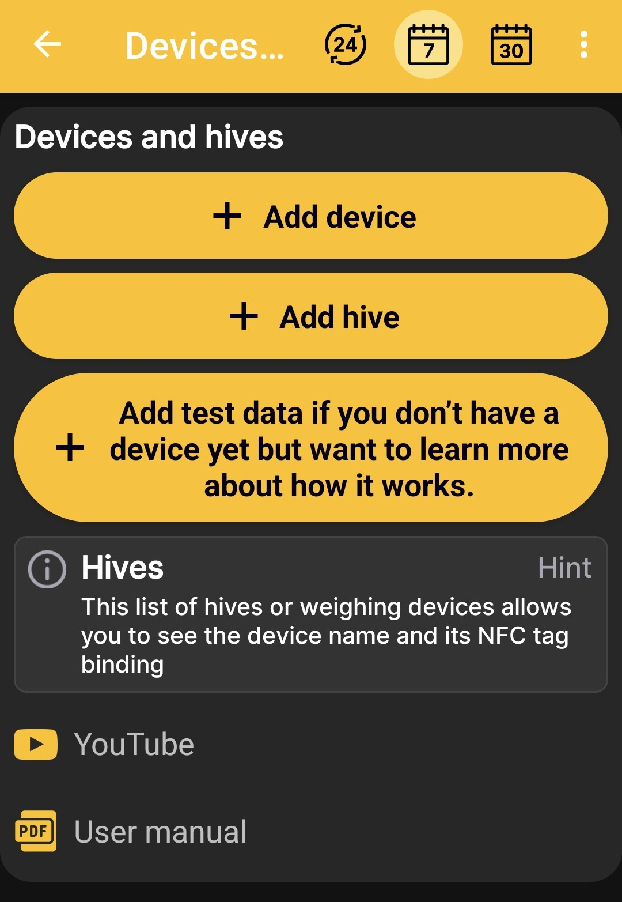

# Añade básculas o una colmena.

El **Dispositivos y colmenas.** La pantalla le permite:

- agregar fisico BeeApiary balanzas de colmena con perfil de colmena;
- crear un perfil de colmena sin ningún equipo;
- Inicie una colmena de demostración con básculas y datos de prueba para explorar la aplicación.

{ .doc-screenshot }

## BeeApiary Balanzas de colmena

El **Agregar dispositivo** El botón crea un perfil de colmena vinculado al físico. BeeApiary balanzas de colmena. Este perfil puede recibir automáticamente peso, temperatura y otras lecturas disponibles.

Continuar con [Añadir BeeApiary Balanzas de colmena](../add-device.md). Puede comparar GSM, una conexión Wi-Fi directa, la red Wi-Fi del apiario y Bluetooth en [Recibir datos en la aplicación](../../system/connectivity.md).

## colmena Sin báscula

El **Agregar colmena** El botón crea un perfil separado sin básculas físicas. Puedes usarlo para llevar un diario, describir el [estado de la colmena](../hive-state.md), agregar notas y registrar [eventos](../events-and-notes.md).

Continuar con [Agregar una colmena](../add-hive.md).

## Colmena de prueba con básculas simuladas

El **Agregar datos de prueba** El botón crea una colmena de demostración con básculas de colmena simuladas. La aplicación genera datos similares a lecturas reales, lo que le permite explorar la pantalla de inicio, los gráficos, el estado de la colmena y los eventos, y trabajar con ellos como lo haría con un perfil vinculado a básculas inteligentes reales.

Los valores de prueba solo sirven para demostrar la aplicación y no son mediciones reales.

## Instrucciones adicionales

Los enlaces a las instrucciones en vídeo de YouTube y al manual del usuario aparecen en la parte inferior de la pantalla. Utilícelos para continuar desde la selección del escenario inicial hasta una guía de configuración detallada.
