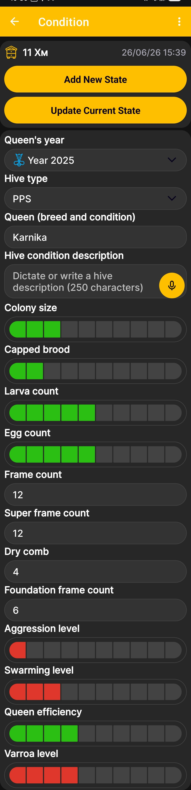

# estado colmena

El estado de la colmena le permite registrar los resultados de la inspección, incluida información sobre la reina, la fuerza de la colonia, la cría, los marcos y otros indicadores importantes. Para abrir esta pantalla desde el [pantalla de inicio de la aplicación](main-screen.md), deslízate hacia la izquierda.

{ .doc-screenshot }

## Agregar y actualizar el estado de la colmena

La colmena seleccionada y la fecha y hora del registro aparecen en la parte superior de la pantalla.

- **Agregar nuevo estado** crea un registro de estado de colmena separado para la fecha y hora seleccionadas.
- **Actualizar estado actual** guarda los cambios en el registro actual sin crear otro estado.

## campos estatales de colmena

| Campo | Qué ingresar |
|---|---|
| **año de la reina** | El año en que la reina fue criada o presentada. |
| **tipo colmena** | La construcción de colmena de la lista configurada de [tipos de colmena](hive-types.md). |
| **Reina (raza y condición)** | La raza de la reina y una breve valoración de su estado actual. |
| **descripción de la condición de la colmena** | Una descripción de forma libre de los resultados de la inspección. |
| **Tamaño de la colonia** | Una evaluación relativa de la fuerza de la colonia utilizando la báscula. |
| **cría tapada** | Una evaluación relativa de la cantidad de cría cubierta. |
| **recuento de larvas** | Una evaluación relativa del número de larvas. |
| **recuento de huevos** | Una evaluación relativa del número de huevos. |
| **Recuento de fotogramas** | El número total de cuadros en la colmena. |
| **Súper recuento de fotogramas** | El número de supermarcos instalados. |
| **peine seco** | El número de fotogramas con peine dibujado. |
| **Recuento de marcos de cimentación** | El número de marcos equipados con cimentación. |
| **Nivel de agresión** | Una evaluación relativa de la agresión colonial. |
| **nivel de enjambre** | Una evaluación relativa del estado de enjambre de la colonia. |
| **Eficiencia reina** | Una evaluación relativa del desempeño de la reina. |
| **nivel de varroa** | Una evaluación relativa de la infestación por varroa. |

Los campos con balanza están destinados a valoraciones relativas, mientras que los campos de marco aceptan recuentos. Ingrese solo la información requerida para la forma en que administra su apiario.

!!! note "Entrada de voz"
    No es necesario que escriba en un campo marcado con un icono de micrófono. Dicta la descripción y la aplicación convertirá tu discurso en texto. Esto crea texto editable, con capacidad de búsqueda y copiable en lugar de guardar un archivo de audio.

El [Orden de campo estatal de la colmena](hive-state-settings.md) El menú determina qué campos aparecen en la pantalla y en qué orden.
