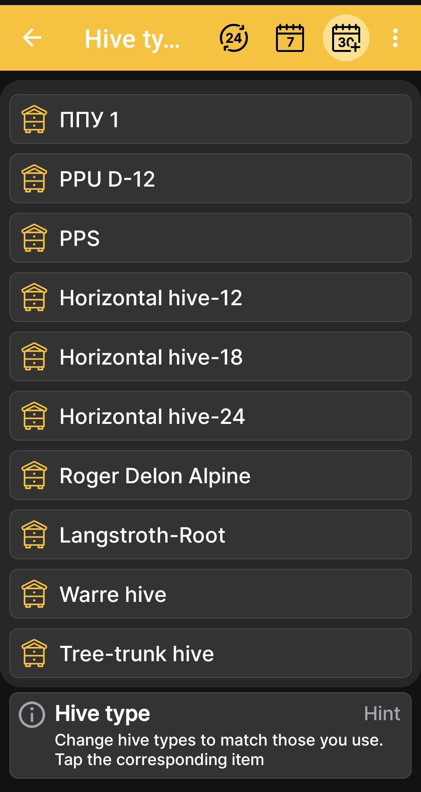

# tipos de colmena

El **tipos de colmena** La pantalla le permite adaptar la lista de tipos de cuerpos de colmena a los utilizados en su apiario. La aplicación incluye varios tipos de muestras, pero la lista inicial no pretende cubrir todos los diseños de colmenas.

La mayoría de los colmenares utilizan entre uno y cinco tipos de cuerpos de colmena, por lo que la lista inicial proporciona capacidad adicional para el uso típico. Puede cambiar libremente los tipos existentes o ampliar la lista para que coincida con su apiario.

1. Abierto **Menú principal → Configuración → tipos de colmena**.
2. Encuentre el tipo requerido en la lista.
3. Toque su mosaico para configurar cómo se usa en la aplicación.

{ .doc-screenshot }

Esta configuración pertenece a las descripciones de la colmena en la aplicación y no cambia la configuración del hardware del BeeApiary balanzas de colmena.
