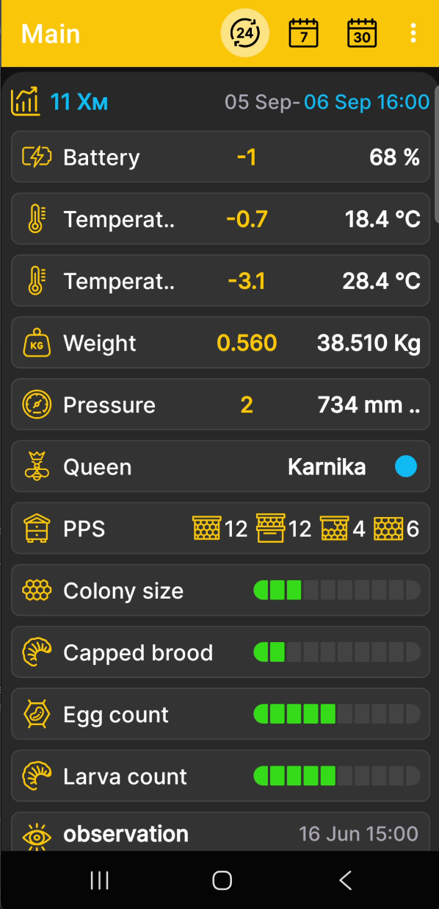

# Pantalla de inicio de la aplicación

La pantalla de inicio reúne lecturas numéricas, el estado de la colmena y los eventos recientes de la colmena seleccionada o BeeApiary balanzas de colmena. La aplicación no tiene una pantalla de medición separada: todos los datos disponibles forman una descripción combinada de la colmena.

{ .doc-screenshot }

## Lo que aparece en la pantalla

- la colmena seleccionada o BeeApiary balanzas de colmena;
- lecturas numéricas de peso, temperatura, humedad, presión y carga de la batería cuando los datos correspondientes estén disponibles;
- [estado de la colmena](hive-state.md), reina, cuadros, cría y otros registros de perfil;
- los cinco más recientes [eventos](events-and-notes.md) registrado por el usuario.

Los bloques disponibles dependen de los datos, sensores e información ingresados ​​para la colmena seleccionada.

La visibilidad y el orden de los mosaicos se configuran en [Seleccionar datos y gráficos](chart-settings.md). Los valores numéricos que cambian con el tiempo también se pueden mostrar como [gráficos](charts.md). Un [configuración de campo separado](hive-state-settings.md) está disponible para el estado colmena.

## Periodo y valores

Los íconos en la parte superior de la pantalla cambian la unidad del período entre días, semanas y meses. Toque el ícono correspondiente repetidamente para seleccionar 1, 2, 3 o más días, semanas o meses en secuencia.

Toque la fecha y la hora en la parte superior del panel de colmena seleccionado para elegir la fecha de finalización del período. Para más detalles, consulte [Período de visualización del gráfico](chart-period.md).

Para cada lectura numérica:

- la última medición al final del período seleccionado aparece a la derecha en blanco;
- el cambio, o delta, entre los valores al principio y al final del período seleccionado aparece en amarillo.

## Navegación rápida

Toque brevemente el encabezado de la colmena seleccionada para abrir la ventana [gráficos](charts.md). Toque y mantenga presionado el título para abrir [selección de datos y orden de gráficos](chart-settings.md).

- Desliza hacia la izquierda para abrir el [estado colmena](hive-state.md), agregar un nuevo registro o actualizar el actual.
- Desliza hacia la derecha para abrir [eventos y notas](events-and-notes.md), agregar un nuevo evento o editar uno existente.
