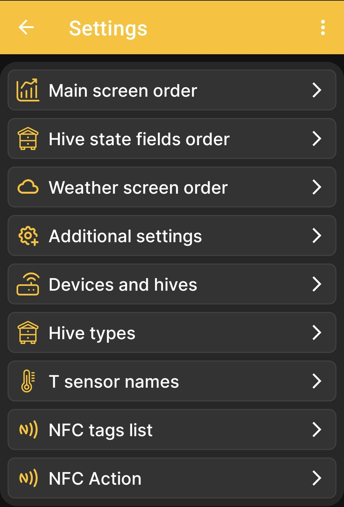

# Configuración de la aplicación

El **Configuración** La página es el menú principal para las opciones de visualización y comportamiento de la aplicación. Cada elemento abre una pantalla infantil independiente.

{ .doc-screenshot }

| Elemento del menú | Función |
|---|---|
| **Orden de la pantalla principal** | Abre [selección de datos y gráficos](../chart-settings.md). Estas configuraciones determinan qué mosaicos aparecen y su orden en la pantalla de inicio y, para valores numéricos, qué gráficos aparecen y su orden en la pantalla de gráficos. |
| **orden de campos estatales de colmena** | Abre el [configuración del campo de estado de la colmena](../hive-state-settings.md). |
| **Orden de la pantalla meteorológica** | Abre el [configuración de datos de pronóstico del tiempo](../weather-settings.md). |
| **Configuraciones adicionales** | Abre [opciones adicionales de comportamiento de la aplicación](../additional-settings.md), incluida la visualización de eventos y el funcionamiento de Bluetooth. |
| **Dispositivos y colmenas.** | Gestiona la lista de perfiles. Añadiendo [BeeApiary balanzas de colmena](../add-device.md) y [una colmena](../add-hive.md) se describen por separado; Aún se está preparando una descripción completa de esta pantalla. |
| **tipos de colmena** | Abre el [lista de tipos de colmenas](../hive-types.md) utilizado en el apiario. |
| **Nombres de sensores T** | Le permite asignar nombres claros a los canales de temperatura. Se agregará una descripción detallada después de una revisión por separado de esta pantalla. |
| **Lista de etiquetas NFC** | Espectáculos [dispositivos y colmenas vinculados vía NFC](../nfc-settings.md#linked-nfc-tags). |
| **Acción NFC** | Selecciona el [acción realizada después de que se reconoce una etiqueta NFC](../nfc-settings.md#nfc-action). |

## Configuraciones relacionadas

Configuración del BeeApiary Las básculas para colmenas a través de su interfaz web local se describen por separado: [Conexión Wi-Fi directa al dispositivo](../../system/local-wifi.md#direct-access-point).

- [Configurar la sincronización a través de la red Wi-Fi de Apiary](../../guides/configure-wifi-sync.md)
- [Configurar la sincronización a través de Bluetooth](../../guides/configure-bluetooth-sync.md)
